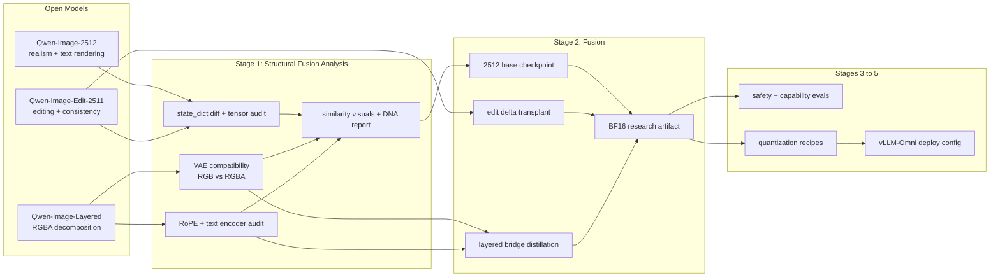

# Qwen-Image 1.9

Qwen-Image 2.0 still is not open, so this repo does the obvious internet thing: build a serious community bridge and make the process readable enough that future-us does not need archaeology tools. The goal is not to cosplay as upstream. The goal is to fuse what is already open, keep the research traceable, and ship a remote-first scaffold that another engineer can actually use.

## What This Repo Actually Does
- Treats `Qwen/Qwen-Image-2512` as the realism-heavy foundation.
- Treats `Qwen/Qwen-Image-Edit-2511` as the edit-skill donor.
- Treats `Qwen/Qwen-Image-Layered` as the weird but useful RGBA outlier we refuse to ignore.
- Assumes heavyweight execution happens on a remote machine, not on the laptop that is currently trying to stay employed.

## The Three-Model Problem
| Model | Job in 1.9 | Expected conflict |
| --- | --- | --- |
| `Qwen/Qwen-Image-2512` | Foundation checkpoint | Baseline for realism/text fidelity |
| `Qwen/Qwen-Image-Edit-2511` | Edit delta donor | Transformer-only delta on top of 2512 |
| `Qwen/Qwen-Image-Layered` | Layered behavior donor | RGBA-VAE and RoPE incompatibilities force a bridge path |

All three public model cards currently advertise Apache-2.0 licensing. The scaffold stores configs, manifests, code, and reports only. Model weights stay remote and uncommitted.

## Roadmap
1. Stage 1: Structural Fusion Analysis
2. Stage 2: Fusion
3. Stage 3: Safety Evaluation and Risk Report
4. Stage 4: Compression
5. Stage 5: Deployment and vLLM-Omni Integration

## System View


## Remote-First Execution Model
- Local repo: authoring, dry-runs, config validation, report assembly.
- Remote machine: model download, tensor inspection at scale, BF16 merge jobs, quantization, deployment benchmarks.
- Shared rule: no committed weights, no local-VRAM assumptions, and every stage must be able to explain itself with manifests and Markdown.

Primary CLI:
```bash
q19 stage1 analyze
q19 stage2 fuse --dry-run
q19 stage2 fuse --smoke-run
q19 stage2 fuse --smoke-run --execute
q19 stage2 fuse --run-profile full --execute
q19 stage3 eval --dry-run
q19 stage4 quantize --dry-run
q19 stage5 deploy --dry-run
```

Common flags:
- `--remote-config`
- `--artifact-dir`
- `--cache-dir`
- `--dry-run`
- `--smoke-run` for Stage 2 quick bug-finder profile
- `--run-profile {smoke,full}` for Stage 2
- `--execute` for Stage 2 job execution after manifest generation
- `--hf-home` for Stage 1 cache inspection override
- `--cache-map-config` for custom HF cache alias mapping

## Repo Map
```text
configs/   remote launch config, model metadata, merge and quant recipes
src/       CLI and stage orchestration code
scripts/   stage-numbered entrypoints mirroring the roadmap
reports/   Markdown and JSON deliverables for each stage
docs/      deeper notes on architecture, remote execution, and release policy
tests/     dry-run and schema validation coverage
examples/  starter prompts and notebook placeholders
```

## Deliverables By Stage
| Stage | Primary deliverable | Secondary output |
| --- | --- | --- |
| 1 | `reports/stage-1/summary.md` | `reports/stage-1/compatibility-matrix.json` plus `reports/stage-1/figures/*.png` |
| 2 | `reports/stage-2/README.md` | `reports/stage-2/merge-manifest.json` plus `reports/stage-2/dataset-manifest.json` |
| 3 | `reports/stage-3-eval-report.md` | eval registry in CLI output |
| 4 | `reports/stage-4-quantization-report.md` | validated GGUF and EXL2 recipes |
| 5 | `reports/stage-5-deployment-report.md` | generated stage config |

## Safety Policy
This repo does not implement safeguard bypass or refusal-vector removal. Stage 3 exists to evaluate capability, misuse risk, and release constraints so the project can document what it is doing without acting like governance is optional.

## Current Status
- Repo scaffold: in place
- Stage numbering: canonical across configs, scripts, reports, and TODO items
- Next checkpoint: [TODO.md](TODO.md)
- Deep notes: [docs/architecture.md](docs/architecture.md), [docs/remote-execution.md](docs/remote-execution.md)
