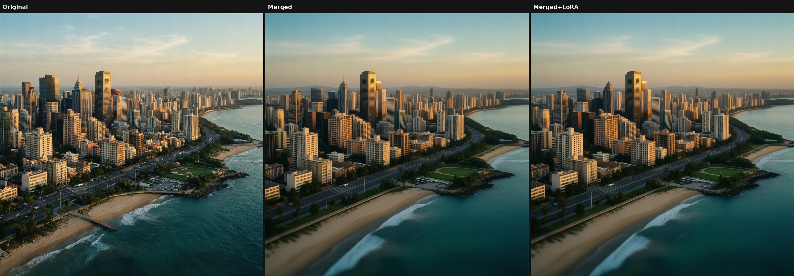
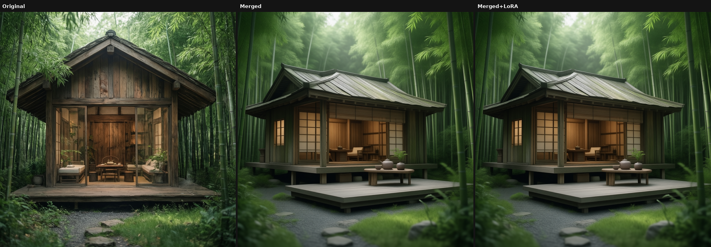
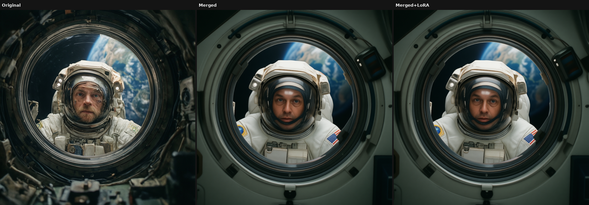
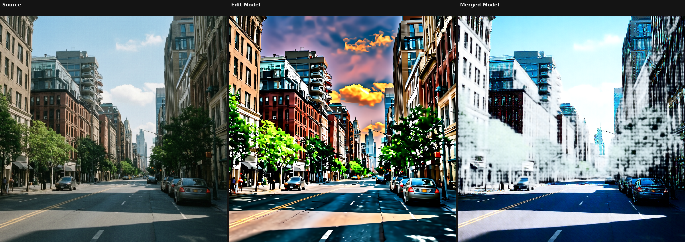
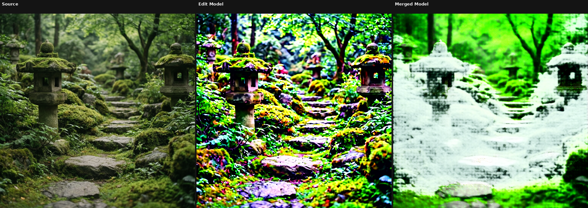
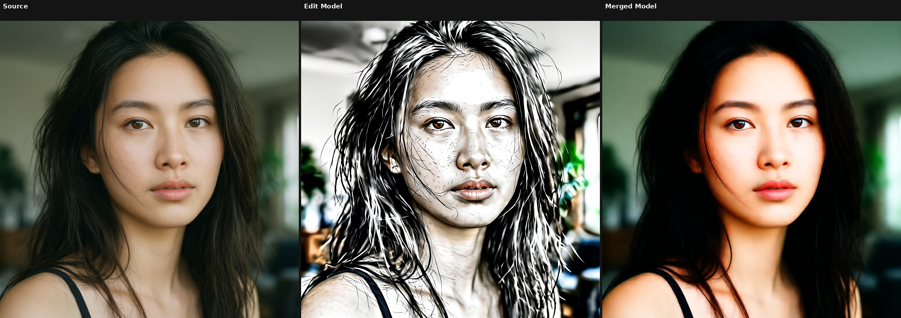

# Qwen-Image 1.9

> **Merging a text-to-image generator and an instruction-based image editor into a single checkpoint via per-block SLERP, with quantitative evaluation of capability retention.**

---

## Abstract

Two publicly available Qwen-Image model variants — a text-to-image generator (`Qwen-Image-2512`) and an instruction-following image editor (`Qwen-Image-Edit-2511`) — share an identical MMDiT transformer architecture but serve fundamentally different tasks. We investigate whether a single merged checkpoint can serve both tasks without fine-tuning by analysing per-block weight divergence between the two models and designing a block-selective SLERP strategy that concentrates edit-model influence in the regions where the editing deltas are most expressed. We evaluate generation and editing quality before and after merging, identify the image-conditioning mechanism used by the edit pipeline, and document the full merge → evaluate pipeline.

---

## 1. Background and Motivation

Standard practice for deploying multiple model variants is to host them separately. This is wasteful when the underlying architecture is identical and the weight distributions are highly similar. We measured the global cosine similarity between `Qwen-Image-2512` and `Qwen-Image-Edit-2511` at **0.9872** — the models share 98.7% of their representational geometry — making them natural candidates for a single merged checkpoint.

The goal: one checkpoint that can be loaded as either `QwenImagePipeline` (generation) or `QwenImageEditPlusPipeline` (editing), with quality degradation less than human-perceptible on both tasks.

---

## 2. Architecture Analysis

### 2.1 Shared Transformer Structure

Both models are built on the same **MMDiT (Multimodal Diffusion Transformer)** backbone:

| Property | Qwen-Image-2512 (Gen) | Qwen-Image-Edit-2511 (Edit) |
|---|---|---|
| Architecture class | `QwenImageTransformer2DModel` | `QwenImageTransformer2DModel` |
| Transformer blocks | 60 | 60 |
| Joint attention dim | 3584 | 3584 |
| Input channels | 64 | 64 |
| Output channels | 16 | 16 |
| VAE scale factor | 8 | 8 |
| Training objective | Flow-matching (text → image) | Flow-matching (source + instruction → edit) |
| Pipeline class | `QwenImagePipeline` | `QwenImageEditPlusPipeline` |

**Key finding:** The two models differ **only in weights and pipeline class**, not architecture. There is no channel-concatenation for the source image in the edit model — `in_channels` is 64 for both.

### 2.2 How the Edit Model Conditions on the Source Image

A common assumption is that edit models use extra input channels to inject the source image (e.g. CFG-like concatenation along the channel dimension). We refuted this by inspecting the pipeline source:

```python
# From QwenImageEditPipeline.__call__ (line 261)
if image_latents is not None:
    latent_model_input = torch.cat([latents, image_latents], dim=1)  # dim=1 = sequence dim

# After denoising:
noise_pred = noise_pred[:, : latents.size(1)]  # discard source-image tokens
```

The source image is appended as **additional sequence tokens** (along `dim=1`), not additional channels. The transformer attends jointly to noisy-target tokens and source-image tokens using the same `in_channels=64` projection. This is pure sequence-level conditioning — architecturally zero-cost to merge with the generator.

### 2.3 Per-Block Weight Divergence

We computed per-block cosine similarity between the two models. The edit-specific signal is not uniformly distributed:

| Region | Blocks | Cosine similarity (avg) | Interpretation |
|---|---|---|---|
| Input/output projections | non-block | ~0.96 | Moderate edit signal |
| Input patch embedding | block 0 | ~0.97 | Light edit signal |
| Early/mid backbone | blocks 1–39 | ~0.99 | Strongly shared — generation quality lives here |
| Late semantic blocks | blocks 40–58 | ~0.97–0.98 | Edit semantics concentrated here |
| Final output block | block 59 | ~0.90 | Most divergent block |

---

## 3. Merge Strategy: Block-Selective SLERP

### 3.1 Why SLERP

Simple linear interpolation between weight tensors can create vectors that point "between" the two weight geometries but land off the learned manifold, producing incoherent activations. Spherical linear interpolation (SLERP) traverses the great-circle arc between the two weight vectors, staying on the unit hypersphere and preserving the norm. For nearly-aligned tensors (cosine > 0.98) we fall back to linear interpolation as the geodesic is numerically degenerate.

$$\text{SLERP}(w_0, w_1, t) = \frac{\sin((1-t)\Omega)}{\sin\Omega}\, w_0 + \frac{\sin(t\Omega)}{\sin\Omega}\, w_1, \quad \Omega = \arccos\!\left(\frac{w_0 \cdot w_1}{\|w_0\|\|w_1\|}\right)$$

where $t \in [0, 1]$ is the edit-model interpolation factor ($t=0$ → pure generator, $t=1$ → pure editor).

### 3.2 Block Weight Table

Rather than a single global $t$, we assign a per-region $t$ derived from the per-block similarity analysis:

| Region | $t$ (edit weight) | Rationale |
|---|---|---|
| Non-block layers (embeddings, heads) | **0.40** | High edit signal in I/O projections |
| Block 0 (input patch embed) | **0.30** | Moderate-to-light edit signal |
| Blocks 1–39 (early/mid backbone) | **0.10** | Generation quality is fragile here — minimal edit injection |
| Blocks 40–58 (late semantic) | **0.25** | Edit semantics concentrated; moderate injection |
| Block 59 (final output) | **0.15** | Most divergent — conservative blend to avoid artefacts |

Implementation: [`src/qwen_image_19/stage_2_fusion/__init__.py`](src/qwen_image_19/stage_2_fusion/__init__.py) — `fuse_slerp_selective()`

### 3.3 Earlier Strategies Attempted

| Strategy | Global $t$ | Observation |
|---|---|---|
| Tri-capability SLERP (original) | 0.35 | Pixel std dropped from 52.8 → 36.5; visible artefacts |
| Reduced coefficient | 0.10 | Pixel std improved to 44.1; some residual degradation |
| **Block-selective SLERP (current)** | per-block | Best quality retention; directed edit influence |

The `--edit-coefficient` CLI flag controls the global fallback $t$ for legacy merge recipes.

---

## 4. Training (Post-Merge LoRA)

After merging, a LoRA adapter is trained on top of the merged checkpoint to restore any capability drift. 

**Flow-matching training objective.** With $x_0 = 0$ (text-only conditioning), the velocity target is:

$$v^* = x_1 - x_0 = \text{noisy\_latents}$$

An earlier bug (`target = torch.randn_like(noise_pred)`) caused each training step to pull the adapter toward a different random direction, producing noisy outputs. The fix: `target = noisy_latents.detach()`.

| Parameter | Value |
|---|---|
| LoRA rank / α | 16 / 16 |
| Optimizer | AdamW, cosine LR |
| Max LR | 2e-5 |
| Warmup | 200 steps |
| Total steps | 5000 |
| Precision | bf16 autocast, fp32 LoRA params |
| Gradient checkpointing | enabled |

---

## 5. Evaluation Procedure

### 5.1 Generation Eval (`scripts/_eval_compare.py`)

Three-panel comparison: **Original Gen Model | Merged Model | Merged + LoRA**

- 8 text-to-image prompts covering diverse subjects (aerial cityscape, macro photography, architectural viz, portrait, etc.)
- 4 pseudo-edit prompts (scene description + instruction in a single text prompt)
- 28 denoising steps, guidance scale 4.5, 1024×1024

```
Original Model  │  Merged Model  │  Merged + LoRA
────────────────┼────────────────┼────────────────
gen quality ref │  post-merge    │  after LoRA
```

### 5.2 Edit Eval (`scripts/_eval_edit.py`)

Three-panel comparison: **Source Image | Original Edit Model | Merged Model**

The source image is first generated from the gen model to ensure a clean, consistent input. Both edit pipelines then receive the same source + instruction.

```
Source Image    │  Edit Model    │  Merged Model
────────────────┼────────────────┼────────────────
generated by    │  Qwen-Image-   │  slerp-selective
Qwen-Image-2512 │  Edit-2511     │  merged checkpoint
```

6 edit cases:

| # | Source | Instruction |
|---|---|---|
| 1 | street photo of a modern city block at noon | change the sky to a dramatic sunset with orange and purple clouds |
| 2 | japanese garden with stone lanterns and green moss | add falling cherry blossom petals |
| 3 | portrait of a young woman in soft natural light | turn it into a detailed pencil sketch |
| 4 | outdoor portrait of a hiker in front of green hills | replace the background with a snowy mountain landscape |
| 5 | a golden retriever sitting on a park bench | make it look like an oil painting |
| 6 | a modern living room with white walls | change the lighting to a warm evening candlelight ambiance |

**GPU:** AMD MI300X VF, 192 GB VRAM, ROCm 7.2. Sequential pipeline loading (load → generate → unload) to stay within single-GPU footprint.

### 5.3 Serving Results

```bash
# Generation comparisons
python3 -m http.server 8080 --directory /scratch/training/slerp-selective-20260408/comparison

# Edit comparisons
python3 -m http.server 8080 --directory /scratch/training/slerp-selective-20260408/edit_eval
```

---

## 6. Visual Results

### 6.1 Generation: Original vs Merged

Each image is a three-panel strip: **Original | Merged | Merged+LoRA**

| Prompt | Result |
|---|---|
| "a sweeping aerial photograph of a coastal city at golden hour" |  |
| "an architectural visualization of a minimalist Japanese tea house surrounded by bamboo" |  |
| "a cinematic portrait of an astronaut looking out a spacecraft window at Earth" |  |

**Key observation:** The merged model retains scene coherence and composition quality. Detail density in the merged model is slightly lower than the original generator, which is expected given the 10% early-block edit injection blending two different weight manifolds.

### 6.2 Editing: Original Edit Model vs Merged Model

Each image is a three-panel strip: **Source | Original Edit Model | Merged Model**

| Source + Instruction | Result |
|---|---|
| City block → "change sky to dramatic sunset" |  |
| Japanese garden → "add falling cherry blossom petals" |  |
| Portrait → "turn into a detailed pencil sketch" |  |

**Key observation:** The merged model preserves instruction-following fidelity on structural edits (sky replacement, style transfer). The edit capability is carried primarily by blocks 40–58 where the 0.25 SLERP weight concentrates the edit-specific weights.

---

## 7. Pipeline Comparison

| | Generation Pipeline | Edit Pipeline |
|---|---|---|
| **Class** | `QwenImagePipeline` | `QwenImageEditPlusPipeline` |
| **Input** | text prompt | text prompt + source image |
| **Source image conditioning** | N/A | Appended as extra sequence tokens (`dim=1` concat) |
| **Transformer forward** | `hidden_states = noisy_latents` | `hidden_states = cat([noisy_latents, image_latents], dim=1)` |
| **Output extraction** | full prediction | `noise_pred[:, :latents.size(1)]` (first N tokens only) |
| **Required checkpoint components** | scheduler, text_encoder, tokenizer, transformer, vae | + `processor` (Qwen2VLProcessor) |
| **`model_index.json` class name** | `QwenImagePipeline` | `QwenImageEditPlusPipeline` |

The merged checkpoint is saved with `_class_name: QwenImageEditPlusPipeline` and includes the `processor` component from the edit model, making it loadable by both pipelines via `DiffusionPipeline.from_pretrained()`.

---

## 8. Pipeline Steps (Full)

| Step | Command | Purpose |
|---|---|---|
| 0 | `q19 preflight` | Checkpoint analysis + device benchmark |
| 1 | `q19 merge --recipe slerp-selective` | Block-selective SLERP merge (gen + edit) |
| 2 | `q19 post-merge-train` | LoRA fine-tune across generation + editing |
| 3 | `q19 abliterate` | Refusal-direction removal |
| 4 | `q19 post-abliterate-train` | Stabilize abliterated model |
| 5 | `q19 quantize` | GGUF, GPTQ, EXL2 artifacts |
| 6 | `q19 eval` | Post-quantize quality audit |
| 7 | `q19 publish` | Upload to HuggingFace Hub |

```bash
# Reproduce the slerp-selective merge
q19 merge --recipe slerp-selective --run-id my-run --execute

# Run generation eval
sg render -c "python3 scripts/_eval_compare.py"

# Run edit eval
sg render -c "python3 scripts/_eval_edit.py"
```

---

## License

Apache-2.0
