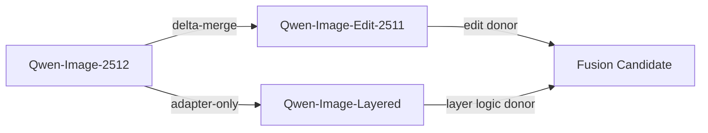

# Stage 1 DNA Report

## Why this report exists
This is the compatibility memo before anybody starts weight-souping 20B checkpoints and then acts surprised when RGBA shows up with a chair.

## Remote execution context
- Remote name: `local-dry-run`
- Remote workdir: `/mnt/experiments/qwen-image-1.9`
- Remote cache: `/mnt/cache/qwen-image`
- Remote artifact dir: `/mnt/artifacts/qwen-image-1.9`

## Model inventory
- `qwen-image-base`: MMDiT / Qwen2.5-VL / RGB-VAE / 2D
- `qwen-image-2512`: MMDiT / Qwen2.5-VL / RGB-VAE / 2D
- `qwen-image-edit-2511`: MMDiT / Qwen2.5-VL / RGB-VAE / 2D
- `qwen-image-layered`: MMDiT / Qwen2.5-VL / RGBA-VAE / Layer3D

## Compatibility matrix
| Subsystem | Models | Classification | Notes |
| --- | --- | --- | --- |
| `mmdit_backbone` | qwen-image-2512, qwen-image-edit-2511 | `delta-merge` | 2512 and 2511 advertise the same MMDiT and text encoder family, so ancestry-aware delta transplant is the lowest-risk starting point. |
| `text_encoder` | qwen-image-2512, qwen-image-edit-2511, qwen-image-layered | `adapter-only` | Shared Qwen2.5-VL family helps, but layered prompt semantics should be merged with conflict resolution rather than naive averaging. |
| `vae` | qwen-image-2512, qwen-image-layered | `incompatible` | Layered exposes RGBA-VAE while the 2512 family uses RGB-VAE. Treat the layered path as adapter-only unless alpha semantics can be preserved. |
| `rope` | qwen-image-2512, qwen-image-layered | `adapter-only` | Foundation uses 2D while layered uses Layer3D; inject only behind an explicit compatibility gate. |

## Summary
- `delta-merge`: 1
- `adapter-only`: 2
- `incompatible`: 1

## Visualization

## Takeaways
- 2512 and Edit-2511 look mergeable through an ancestry-aware delta path.
- Layered should be treated as a donor of logic, not as a drop-in checkpoint replacement.
- VAE mismatch is the obvious “do not hand-wave this” blocker.
