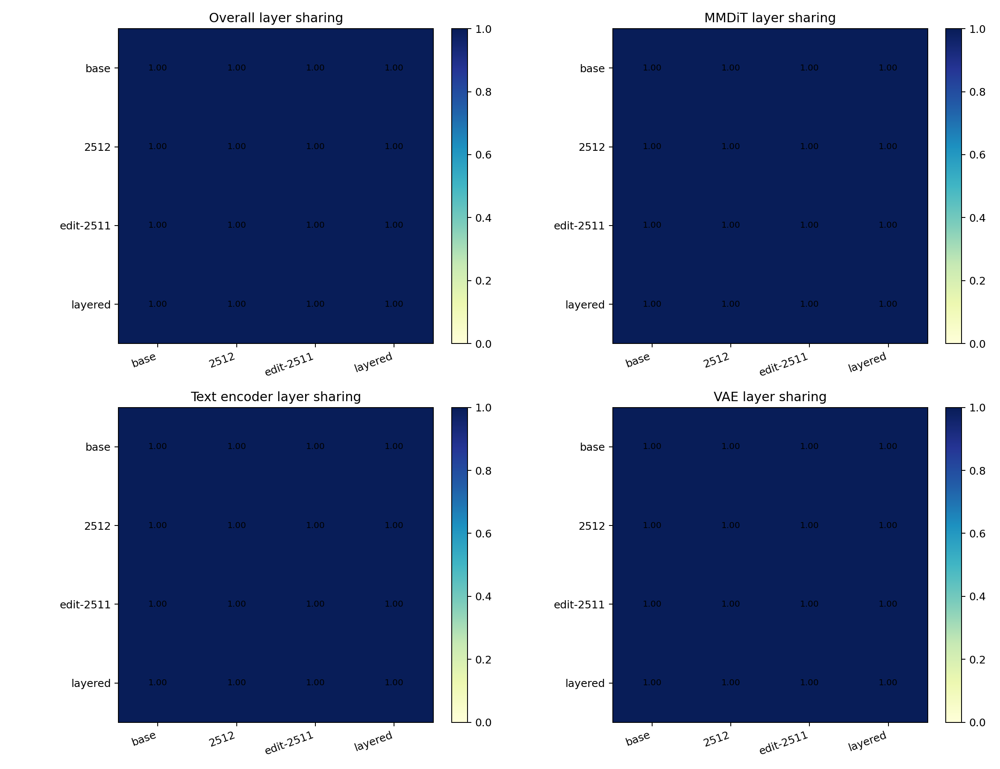
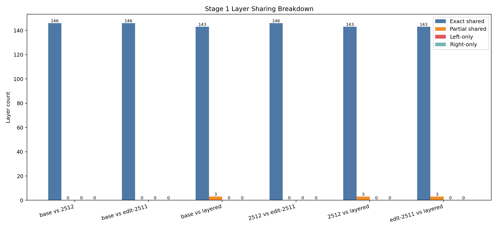
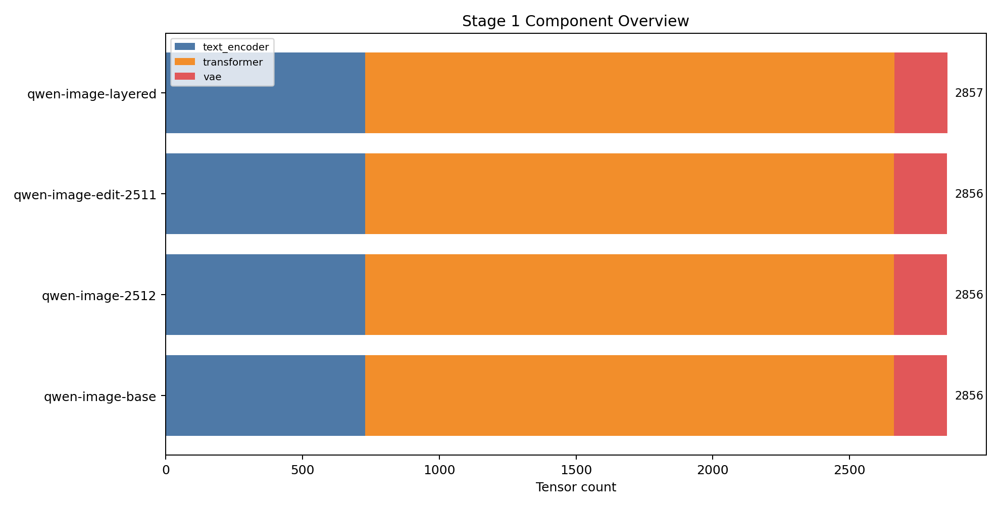
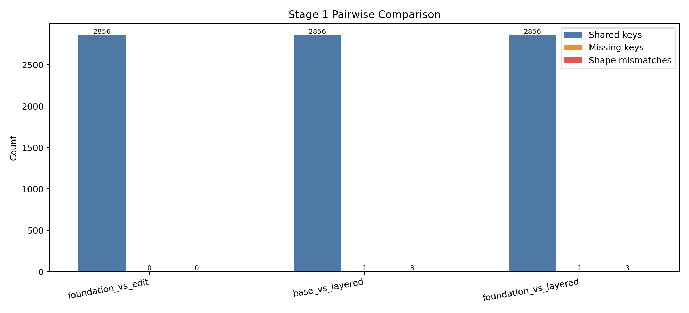
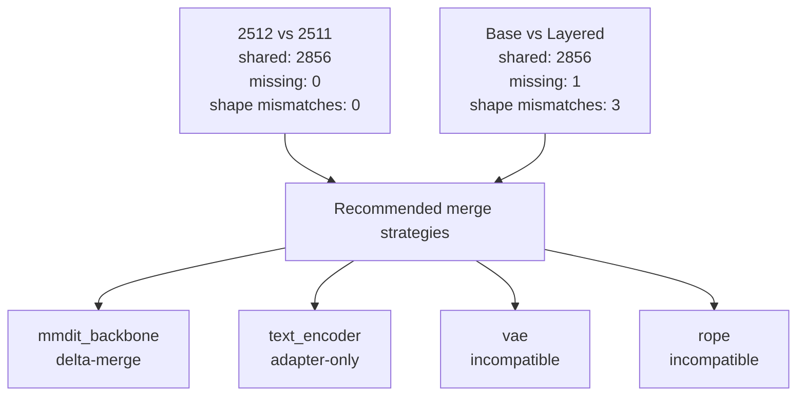

# Stage 1 Paper-Style Block Architecture Review

## Abstract
Stage 1 now combines structural checkpoint compatibility with value-level block comparison for roadmap pairs. The key result is whether models are not only architecturally aligned, but also numerically close enough per block to support low-risk fusion decisions.

## Setup
- Remote name: `local-dry-run`
- Remote workdir: `/mnt/experiments/qwen-image-1.9`
- Remote cache: `/mnt/cache/qwen-image`
- Remote artifact dir: `/mnt/artifacts/qwen-image-1.9`
- HF home: `/lustre_scratch/user_scratch/zziang/huggingface`
- Weight analysis available: `False`
- Low-delta threshold: `relative_l2_delta <= 1e-06`

## Methods
Phase A: structural analysis from shard metadata (key overlap, missing keys, shape mismatches, layer normalization).

Phase B: value-level analysis from loaded tensor payloads on roadmap pairs, with block rollups:
- `exact_tensor_match_ratio`
- `low_delta_tensor_ratio`
- `block_relative_l2_delta`
- `block_mean_abs_delta` and `block_max_abs_delta`

## Cache Entries Inspected
- `qwen-image-base` -> `models--Qwen--Qwen-Image`
- `qwen-image-2512` -> `models--Qwen--Qwen-Image-2512`
- `qwen-image-edit-2511` -> `models--Qwen--Qwen-Image-Edit-2511`
- `qwen-image-layered` -> `models--Qwen--Qwen-Image-Layered`

## Results

### Model Snapshot Inventory
| Alias | Layout | Components | Commit | Shards | Tensor count | Normalized layers | VAE | RoPE hint |
| --- | --- | --- | --- | --- | --- | --- | --- | --- |
| `qwen-image-base` | `componentized` | `text_encoder, transformer, vae` | `75e0b4be04f60ec59a75f475837eced720f823b6` | `14` | `2856` | `146` | `RGB` | `2D-or-rotary` |
| `qwen-image-2512` | `componentized` | `text_encoder, transformer, vae` | `25468b98e3276ca6700de15c6628e51b7de54a26` | `14` | `2856` | `146` | `RGB` | `2D-or-rotary` |
| `qwen-image-edit-2511` | `componentized` | `text_encoder, transformer, vae` | `6f3ccc0b56e431dc6a0c2b2039706d7d26f22cb9` | `10` | `2856` | `146` | `RGB` | `2D-or-rotary` |
| `qwen-image-layered` | `componentized` | `text_encoder, transformer, vae` | `8f0ca708dfff6ba1dd5f2d85d78f8c108a040bcf` | `10` | `2857` | `146` | `RGBA` | `Layer3D` |

### Component Tensor Counts
| Alias | Component | Tensor count |
| --- | --- | --- |
| `qwen-image-base` | `text_encoder` | `729` |
| `qwen-image-base` | `transformer` | `1933` |
| `qwen-image-base` | `vae` | `194` |
| `qwen-image-2512` | `text_encoder` | `729` |
| `qwen-image-2512` | `transformer` | `1933` |
| `qwen-image-2512` | `vae` | `194` |
| `qwen-image-edit-2511` | `text_encoder` | `729` |
| `qwen-image-edit-2511` | `transformer` | `1933` |
| `qwen-image-edit-2511` | `vae` | `194` |
| `qwen-image-layered` | `text_encoder` | `729` |
| `qwen-image-layered` | `transformer` | `1934` |
| `qwen-image-layered` | `vae` | `194` |

### Tensor Pairwise Comparison Stats
| Pair | Shared keys | Missing keys | Shape mismatches | Top mismatch prefixes | Left components | Right components |
| --- | --- | --- | --- | --- | --- | --- |
| `foundation_vs_edit` | `2856` | `0` | `0` | `none` | `text_encoder:729, transformer:1933, vae:194` | `text_encoder:729, transformer:1933, vae:194` |
| `base_vs_layered` | `2856` | `1` | `3` | `vae.decoder, transformer.time_text_embed, vae.encoder` | `text_encoder:729, transformer:1933, vae:194` | `text_encoder:729, transformer:1934, vae:194` |
| `foundation_vs_layered` | `2856` | `1` | `3` | `vae.decoder, transformer.time_text_embed, vae.encoder` | `text_encoder:729, transformer:1933, vae:194` | `text_encoder:729, transformer:1934, vae:194` |

### Layer Inventory Summary
| Alias | Normalized layers | Subsystem counts |
| --- | --- | --- |
| `qwen-image-base` | `146` | `text_encoder:61, mmdit_backbone:61, vae:24` |
| `qwen-image-2512` | `146` | `text_encoder:61, mmdit_backbone:61, vae:24` |
| `qwen-image-edit-2511` | `146` | `text_encoder:61, mmdit_backbone:61, vae:24` |
| `qwen-image-layered` | `146` | `text_encoder:61, mmdit_backbone:61, vae:24` |

### Layer Sharing Across All Pairs
| Pair | Shared layers | Exact | Partial | Left-only | Right-only | Shape-mismatched layers | Shared ratio |
| --- | --- | --- | --- | --- | --- | --- | --- |
| `base vs 2512` | `146` | `146` | `0` | `0` | `0` | `0` | `1.0` |
| `base vs edit-2511` | `146` | `146` | `0` | `0` | `0` | `0` | `1.0` |
| `base vs layered` | `146` | `143` | `3` | `0` | `0` | `2` | `1.0` |
| `2512 vs edit-2511` | `146` | `146` | `0` | `0` | `0` | `0` | `1.0` |
| `2512 vs layered` | `146` | `143` | `3` | `0` | `0` | `2` | `1.0` |
| `edit-2511 vs layered` | `146` | `143` | `3` | `0` | `0` | `2` | `1.0` |

### Block Review Executive Summary
| Pair | Comparable tensors | Exact ratio | Low-delta ratio | Mean relative L2 delta | Mean block similarity |
| --- | --- | --- | --- | --- | --- |
| `2512 vs edit-2511` | `—` | `—` | `—` | `—` | `—` |
| `base vs layered` | `—` | `—` | `—` | `—` | `—` |
| `2512 vs layered` | `—` | `—` | `—` | `—` | `—` |

### Value-Level Weight Comparison
| Pair | Comparable tensors | Exact-equal tensors | Exact ratio | Low-delta ratio | Mean relative L2 delta | Max relative L2 delta | Missing excluded | Shape excluded | Dtype excluded |
| --- | --- | --- | --- | --- | --- | --- | --- | --- | --- |
| `2512 vs edit-2511` | `—` | `—` | `—` | `—` | `—` | `—` | `—` | `—` | `—` |
| `base vs layered` | `—` | `—` | `—` | `—` | `—` | `—` | `—` | `—` | `—` |
| `2512 vs layered` | `—` | `—` | `—` | `—` | `—` | `—` | `—` | `—` | `—` |

## Hardware Account + Time Usage
### Environment
| Item | Value |
| --- | --- |
| Hostname | `nodegpu217` |
| OS | `Linux-4.18.0-553.42.1.el8_10.x86_64-x86_64-with-glibc2.28` |
| Python | `3.12.13` |
| CPU model | `x86_64` |
| Logical cores | `128` |
| Total RAM | `1.47 TiB` |
| GPU detected | `True` (nvidia) |
| GPU used in Stage 1 | `False` |
| HF home | `/lustre_scratch/user_scratch/zziang/huggingface` |
| Artifact dir | `/lustre_scratch/user_scratch/zziang/qwen-image-1.9/reports/stage-1` |

### Phase Timing
| Phase | Seconds | Percent of total |
| --- | --- | --- |
| `setup_context` | `0.0023` | `0.0755%` |
| `cache_snapshot_discovery` | `0.0024` | `0.0793%` |
| `structural_manifest_build` | `0.8385` | `27.7905%` |
| `pairwise_structural_layer` | `0.0371` | `1.2304%` |
| `value_level_weight_comparison` | `0.0` | `0.0001%` |
| `figure_generation` | `1.9994` | `66.2625%` |
| `report_json_write` | `0.1343` | `4.4518%` |

### Roadmap Pair Workload
| Pair | Comparable tensors | Left bytes | Right bytes | Total bytes | Missing excluded | Shape excluded | Dtype excluded |
| --- | --- | --- | --- | --- | --- | --- | --- |
| `2512 vs edit-2511` | `0` | `unknown` | `unknown` | `unknown` | `0` | `0` | `0` |
| `base vs layered` | `0` | `unknown` | `unknown` | `unknown` | `0` | `0` | `0` |
| `2512 vs layered` | `0` | `unknown` | `unknown` | `unknown` | `0` | `0` | `0` |

### Runtime Estimate vs Observed
- Observed total wall time: `3.0173s`
- Value-analysis bytes processed: `0.00 B` (`0.0 GiB`)
- Estimated total runtime (low/typical/high): `0.0s` / `0.0s` / `0.0s`
- Operational note: Stage 1 value comparison is CPU and storage I/O bound; GPU is not required.

### Subsystem Compatibility And Strategy
| Subsystem | Models | Structural compatibility | Recommended merge strategy | Shared keys | Missing keys | Shape mismatches | Notes |
| --- | --- | --- | --- | --- | --- | --- | --- |
| `mmdit_backbone` | qwen-image-2512, qwen-image-edit-2511 | `direct-merge` | `delta-merge` | `1933` | `0` | `0` | Use real shared-key and shape stats between 2512 and 2511 to justify a delta merge path without pretending the strategy is the same thing as structural parity. |
| `text_encoder` | qwen-image-base, qwen-image-layered, qwen-image-2512 | `direct-merge` | `adapter-only` | `729` | `0` | `0` | Layered is compared against its ancestry base first, then mapped onto the 2512 foundation as adapter-only logic unless exact parity is proven. |
| `vae` | qwen-image-base, qwen-image-layered | `incompatible` | `incompatible` | `194` | `0` | `3` | Base VAE channels RGB (3->3) vs layered VAE channels RGBA (4->4). |
| `rope` | qwen-image-2512, qwen-image-layered | `incompatible` | `incompatible` | `0` | `0` | `0` | Foundation rope hint `2D-or-rotary` vs layered rope hint `Layer3D`. |

### Structural Summary
- `direct-merge`: 2
- `adapter-only`: 0
- `incompatible`: 2

### Recommended Strategy Summary
- `direct-merge`: 0
- `delta-merge`: 1
- `adapter-only`: 1
- `incompatible`: 2

### Evidence Confidence
- Structural evidence confidence: `high` for key/shape compatibility and component-level taxonomy.
- Value evidence confidence: `high` for compared tensors in roadmap pairs, `not-applicable` for excluded tensors (missing/shape/dtype mismatch).

### Primary Figures

### Supporting Figures

### Layer Sharing By Subsystem
### mmdit_backbone
| Pair | Shared layers | Exact | Partial | Shape-mismatched layers | Shared ratio |
| --- | --- | --- | --- | --- | --- |
| `base vs 2512` | `61` | `61` | `0` | `0` | `1.0` |
| `base vs edit-2511` | `61` | `61` | `0` | `0` | `1.0` |
| `base vs layered` | `61` | `60` | `1` | `0` | `1.0` |
| `2512 vs edit-2511` | `61` | `61` | `0` | `0` | `1.0` |
| `2512 vs layered` | `61` | `60` | `1` | `0` | `1.0` |
| `edit-2511 vs layered` | `61` | `60` | `1` | `0` | `1.0` |

### text_encoder
| Pair | Shared layers | Exact | Partial | Shape-mismatched layers | Shared ratio |
| --- | --- | --- | --- | --- | --- |
| `base vs 2512` | `61` | `61` | `0` | `0` | `1.0` |
| `base vs edit-2511` | `61` | `61` | `0` | `0` | `1.0` |
| `base vs layered` | `61` | `61` | `0` | `0` | `1.0` |
| `2512 vs edit-2511` | `61` | `61` | `0` | `0` | `1.0` |
| `2512 vs layered` | `61` | `61` | `0` | `0` | `1.0` |
| `edit-2511 vs layered` | `61` | `61` | `0` | `0` | `1.0` |

### vae
| Pair | Shared layers | Exact | Partial | Shape-mismatched layers | Shared ratio |
| --- | --- | --- | --- | --- | --- |
| `base vs 2512` | `24` | `24` | `0` | `0` | `1.0` |
| `base vs edit-2511` | `24` | `24` | `0` | `0` | `1.0` |
| `base vs layered` | `24` | `22` | `2` | `2` | `1.0` |
| `2512 vs edit-2511` | `24` | `24` | `0` | `0` | `1.0` |
| `2512 vs layered` | `24` | `22` | `2` | `2` | `1.0` |
| `edit-2511 vs layered` | `24` | `22` | `2` | `2` | `1.0` |

### rope
| Pair | Shared layers | Exact | Partial | Shape-mismatched layers | Shared ratio |
| --- | --- | --- | --- | --- | --- |
| `base vs 2512` | `0` | `0` | `0` | `0` | `0.0` |
| `base vs edit-2511` | `0` | `0` | `0` | `0` | `0.0` |
| `base vs layered` | `0` | `0` | `0` | `0` | `0.0` |
| `2512 vs edit-2511` | `0` | `0` | `0` | `0` | `0.0` |
| `2512 vs layered` | `0` | `0` | `0` | `0` | `0.0` |
| `edit-2511 vs layered` | `0` | `0` | `0` | `0` | `0.0` |

### Top Divergent Layers
### 2512 vs edit-2511
| Layer | Reason | Left params | Right params | Shape mismatches | Left-only samples | Right-only samples |
| --- | --- | --- | --- | --- | --- | --- |
| `none` | `no divergent layers captured` | `0` | `0` | `0` | `none` | `none` |

### base vs layered
| Layer | Reason | Left params | Right params | Shape mismatches | Left-only samples | Right-only samples |
| --- | --- | --- | --- | --- | --- | --- |
| `vae:decoder.conv_out` | `shape mismatches=2` | `2` | `2` | `2` | `none` | `none` |
| `vae:encoder.conv_in` | `shape mismatches=1` | `2` | `2` | `1` | `none` | `none` |
| `transformer:__global__` | `right-only params=1` | `13` | `14` | `0` | `none` | `time_text_embed.addition_t_embedding.weight` |

### 2512 vs layered
| Layer | Reason | Left params | Right params | Shape mismatches | Left-only samples | Right-only samples |
| --- | --- | --- | --- | --- | --- | --- |
| `vae:decoder.conv_out` | `shape mismatches=2` | `2` | `2` | `2` | `none` | `none` |
| `vae:encoder.conv_in` | `shape mismatches=1` | `2` | `2` | `1` | `none` | `none` |
| `transformer:__global__` | `right-only params=1` | `13` | `14` | `0` | `none` | `time_text_embed.addition_t_embedding.weight` |

### Block-By-Block Weight Tables
### 2512 vs edit-2511

_Weight layer data not available (smoke mode)._

### base vs layered

_Weight layer data not available (smoke mode)._

### 2512 vs layered

_Weight layer data not available (smoke mode)._

### Weight-Level Divergences
### 2512 vs edit-2511

_Weight divergence data not available (smoke mode)._

### base vs layered

_Weight divergence data not available (smoke mode)._

### 2512 vs layered

_Weight divergence data not available (smoke mode)._

### Secondary Visualization

## Limitations
- Numeric comparisons are only performed on shared tensors with matching shape and dtype.
- This report does not measure prompt-level behavior or generation quality; it characterizes checkpoint architecture and weight drift.
- Non-roadmap pair value analysis is intentionally out of scope for runtime control.
