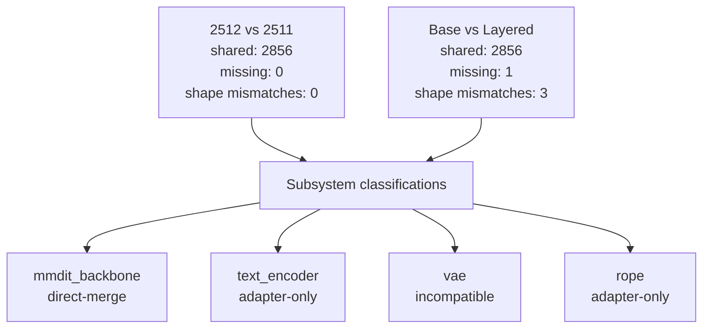

# Stage 1 DNA Report

## Why this report exists
This report is built from the Hugging Face cache snapshots, not from repo metadata vibes. If a subsystem gets called compatible here, it had to survive actual shard and tensor inspection first.

## Remote execution context
- Remote name: `local-dry-run`
- Remote workdir: `/mnt/experiments/qwen-image-1.9`
- Remote cache: `/mnt/cache/qwen-image`
- Remote artifact dir: `/mnt/artifacts/qwen-image-1.9`
- HF home: `/lustre_scratch/user_scratch/zziang/huggingface`

## Cache entries inspected
- `qwen-image-base` -> `models--Qwen--Qwen-Image`
- `qwen-image-2512` -> `models--Qwen--Qwen-Image-2512`
- `qwen-image-edit-2511` -> `models--Qwen--Qwen-Image-Edit-2511`
- `qwen-image-layered` -> `models--Qwen--Qwen-Image-Layered`

## Model snapshot inventory
| Alias | Layout | Components | Commit | Shards | Tensor count | VAE | RoPE hint |
| --- | --- | --- | --- | --- | --- | --- | --- |
| `qwen-image-base` | `componentized` | `text_encoder, transformer, vae` | `75e0b4be04f60ec59a75f475837eced720f823b6` | `14` | `2856` | `RGB` | `2D-or-rotary` |
| `qwen-image-2512` | `componentized` | `text_encoder, transformer, vae` | `25468b98e3276ca6700de15c6628e51b7de54a26` | `14` | `2856` | `RGB` | `2D-or-rotary` |
| `qwen-image-edit-2511` | `componentized` | `text_encoder, transformer, vae` | `6f3ccc0b56e431dc6a0c2b2039706d7d26f22cb9` | `10` | `2856` | `RGB` | `2D-or-rotary` |
| `qwen-image-layered` | `componentized` | `text_encoder, transformer, vae` | `8f0ca708dfff6ba1dd5f2d85d78f8c108a040bcf` | `10` | `2857` | `RGBA` | `Layer3D` |

## Component tensor counts
| Alias | Component | Tensor count |
| --- | --- | --- |
| `qwen-image-base` | `text_encoder` | `729` |
| `qwen-image-base` | `transformer` | `1933` |
| `qwen-image-base` | `vae` | `194` |
| `qwen-image-2512` | `text_encoder` | `729` |
| `qwen-image-2512` | `transformer` | `1933` |
| `qwen-image-2512` | `vae` | `194` |
| `qwen-image-edit-2511` | `text_encoder` | `729` |
| `qwen-image-edit-2511` | `transformer` | `1933` |
| `qwen-image-edit-2511` | `vae` | `194` |
| `qwen-image-layered` | `text_encoder` | `729` |
| `qwen-image-layered` | `transformer` | `1934` |
| `qwen-image-layered` | `vae` | `194` |

## Pairwise comparison stats
| Pair | Shared keys | Missing keys | Shape mismatches | Top mismatch prefixes | Left components | Right components |
| --- | --- | --- | --- | --- | --- | --- |
| `foundation_vs_edit` | `2856` | `0` | `0` | `none` | `text_encoder:729, transformer:1933, vae:194` | `text_encoder:729, transformer:1933, vae:194` |
| `base_vs_layered` | `2856` | `1` | `3` | `decoder.conv_out, time_text_embed.addition_t_embedding, encoder.conv_in` | `text_encoder:729, transformer:1933, vae:194` | `text_encoder:729, transformer:1934, vae:194` |
| `foundation_vs_layered` | `2856` | `1` | `3` | `decoder.conv_out, time_text_embed.addition_t_embedding, encoder.conv_in` | `text_encoder:729, transformer:1933, vae:194` | `text_encoder:729, transformer:1934, vae:194` |

## Subsystem classifications
| Subsystem | Models | Classification | Shared keys | Missing keys | Shape mismatches | Notes |
| --- | --- | --- | --- | --- | --- | --- |
| `mmdit_backbone` | qwen-image-2512, qwen-image-edit-2511 | `direct-merge` | `1933` | `0` | `0` | Use real shared-key and shape stats between 2512 and 2511 to justify a delta merge path. |
| `text_encoder` | qwen-image-base, qwen-image-layered, qwen-image-2512 | `adapter-only` | `729` | `0` | `0` | Layered is compared against its ancestry base first, then mapped onto the 2512 foundation as adapter-only logic unless exact parity is proven. |
| `vae` | qwen-image-base, qwen-image-layered | `incompatible` | `194` | `0` | `3` | Base VAE channels [1, 3, 16, 32, 96, 192, 384, 768, 1152] vs layered VAE channels [1, 4, 16, 32, 96, 192, 384, 768, 1152]. |
| `rope` | qwen-image-2512, qwen-image-layered | `adapter-only` | `729` | `0` | `0` | Foundation rope hint `2D-or-rotary` vs layered rope hint `Layer3D`. |

## Summary
- `direct-merge`: 1
- `delta-merge`: 0
- `adapter-only`: 2
- `incompatible`: 1

## Figures

## Secondary visualization

## Takeaways
- `2512` vs `2511` is now backed by real shared-key and shape stats.
- `Layered` is judged first against `Qwen-Image` ancestry, then mapped onto the `2512` foundation.
- VAE and RoPE claims are tied to checkpoint evidence instead of hard-coded roadmap assumptions.
