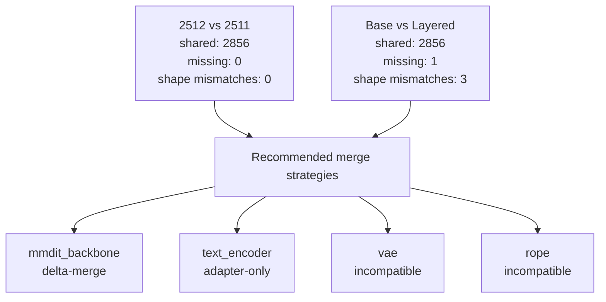

# Stage 1 Paper-Style Block Architecture Review

## Abstract
Stage 1 now combines structural checkpoint compatibility with value-level block comparison for roadmap pairs. The key result is whether models are not only architecturally aligned, but also numerically close enough per block to support low-risk fusion decisions.

## Setup
- Remote name: `local-dry-run`
- Remote workdir: `/mnt/experiments/qwen-image-1.9`
- Remote cache: `/mnt/cache/qwen-image`
- Remote artifact dir: `/mnt/artifacts/qwen-image-1.9`
- HF home: `/lustre_scratch/user_scratch/zziang/huggingface`
- Weight analysis available: `True`
- Low-delta threshold: `relative_l2_delta <= 1e-06`

## Methods
Phase A: structural analysis from shard metadata (key overlap, missing keys, shape mismatches, layer normalization).

Phase B: value-level analysis from loaded tensor payloads on roadmap pairs, with block rollups:
- `exact_tensor_match_ratio`
- `low_delta_tensor_ratio`
- `block_relative_l2_delta`
- `block_mean_abs_delta` and `block_max_abs_delta`

## Cache Entries Inspected
- `qwen-image-base` -> `models--Qwen--Qwen-Image`
- `qwen-image-2512` -> `models--Qwen--Qwen-Image-2512`
- `qwen-image-edit-2511` -> `models--Qwen--Qwen-Image-Edit-2511`
- `qwen-image-layered` -> `models--Qwen--Qwen-Image-Layered`

## Results

### Model Snapshot Inventory
| Alias | Layout | Components | Commit | Shards | Tensor count | Normalized layers | VAE | RoPE hint |
| --- | --- | --- | --- | --- | --- | --- | --- | --- |
| `qwen-image-base` | `componentized` | `text_encoder, transformer, vae` | `75e0b4be04f60ec59a75f475837eced720f823b6` | `14` | `2856` | `146` | `RGB` | `2D-or-rotary` |
| `qwen-image-2512` | `componentized` | `text_encoder, transformer, vae` | `25468b98e3276ca6700de15c6628e51b7de54a26` | `14` | `2856` | `146` | `RGB` | `2D-or-rotary` |
| `qwen-image-edit-2511` | `componentized` | `text_encoder, transformer, vae` | `6f3ccc0b56e431dc6a0c2b2039706d7d26f22cb9` | `10` | `2856` | `146` | `RGB` | `2D-or-rotary` |
| `qwen-image-layered` | `componentized` | `text_encoder, transformer, vae` | `8f0ca708dfff6ba1dd5f2d85d78f8c108a040bcf` | `10` | `2857` | `146` | `RGBA` | `Layer3D` |

### Component Tensor Counts
| Alias | Component | Tensor count |
| --- | --- | --- |
| `qwen-image-base` | `text_encoder` | `729` |
| `qwen-image-base` | `transformer` | `1933` |
| `qwen-image-base` | `vae` | `194` |
| `qwen-image-2512` | `text_encoder` | `729` |
| `qwen-image-2512` | `transformer` | `1933` |
| `qwen-image-2512` | `vae` | `194` |
| `qwen-image-edit-2511` | `text_encoder` | `729` |
| `qwen-image-edit-2511` | `transformer` | `1933` |
| `qwen-image-edit-2511` | `vae` | `194` |
| `qwen-image-layered` | `text_encoder` | `729` |
| `qwen-image-layered` | `transformer` | `1934` |
| `qwen-image-layered` | `vae` | `194` |

### Tensor Pairwise Comparison Stats
| Pair | Shared keys | Missing keys | Shape mismatches | Top mismatch prefixes | Left components | Right components |
| --- | --- | --- | --- | --- | --- | --- |
| `foundation_vs_edit` | `2856` | `0` | `0` | `none` | `text_encoder:729, transformer:1933, vae:194` | `text_encoder:729, transformer:1933, vae:194` |
| `base_vs_layered` | `2856` | `1` | `3` | `vae.decoder, transformer.time_text_embed, vae.encoder` | `text_encoder:729, transformer:1933, vae:194` | `text_encoder:729, transformer:1934, vae:194` |
| `foundation_vs_layered` | `2856` | `1` | `3` | `vae.decoder, transformer.time_text_embed, vae.encoder` | `text_encoder:729, transformer:1933, vae:194` | `text_encoder:729, transformer:1934, vae:194` |

### Layer Inventory Summary
| Alias | Normalized layers | Subsystem counts |
| --- | --- | --- |
| `qwen-image-base` | `146` | `text_encoder:61, mmdit_backbone:61, vae:24` |
| `qwen-image-2512` | `146` | `text_encoder:61, mmdit_backbone:61, vae:24` |
| `qwen-image-edit-2511` | `146` | `text_encoder:61, mmdit_backbone:61, vae:24` |
| `qwen-image-layered` | `146` | `text_encoder:61, mmdit_backbone:61, vae:24` |

### Layer Sharing Across All Pairs
| Pair | Shared layers | Exact | Partial | Left-only | Right-only | Shape-mismatched layers | Shared ratio |
| --- | --- | --- | --- | --- | --- | --- | --- |
| `base vs 2512` | `146` | `146` | `0` | `0` | `0` | `0` | `1.0` |
| `base vs edit-2511` | `146` | `146` | `0` | `0` | `0` | `0` | `1.0` |
| `base vs layered` | `146` | `143` | `3` | `0` | `0` | `2` | `1.0` |
| `2512 vs edit-2511` | `146` | `146` | `0` | `0` | `0` | `0` | `1.0` |
| `2512 vs layered` | `146` | `143` | `3` | `0` | `0` | `2` | `1.0` |
| `edit-2511 vs layered` | `146` | `143` | `3` | `0` | `0` | `2` | `1.0` |

### Block Review Executive Summary
| Pair | Comparable tensors | Exact ratio | Low-delta ratio | Mean relative L2 delta | Mean block similarity |
| --- | --- | --- | --- | --- | --- |
| `2512 vs edit-2511` | `2856` | `0.3246` | `0.3246` | `0.0757626437` | `0.9073` |
| `base vs layered` | `2853` | `0.2611` | `0.2611` | `0.0661978195` | `0.8647` |
| `2512 vs layered` | `2853` | `0.2597` | `0.2597` | `0.1002445725` | `0.8223` |

### Value-Level Weight Comparison
| Pair | Comparable tensors | Exact-equal tensors | Exact ratio | Low-delta ratio | Mean relative L2 delta | Max relative L2 delta | Missing excluded | Shape excluded | Dtype excluded |
| --- | --- | --- | --- | --- | --- | --- | --- | --- | --- |
| `2512 vs edit-2511` | `2856` | `927` | `0.3246` | `0.3246` | `0.0757626437` | `0.7148181988` | `0` | `0` | `0` |
| `base vs layered` | `2853` | `745` | `0.2611` | `0.2611` | `0.0661978195` | `1.0472772873` | `1` | `3` | `0` |
| `2512 vs layered` | `2853` | `741` | `0.2597` | `0.2597` | `0.1002445725` | `1.0472772873` | `1` | `3` | `0` |

## Hardware Account + Time Usage
### Environment
| Item | Value |
| --- | --- |
| Hostname | `noderome104` |
| OS | `Linux-4.18.0-553.42.1.el8_10.x86_64-x86_64-with-glibc2.28` |
| Python | `3.12.13` |
| CPU model | `x86_64` |
| Logical cores | `64` |
| Total RAM | `1003.37 GiB` |
| GPU detected | `True` (nvidia) |
| GPU used in Stage 1 | `False` |
| HF home | `/lustre_scratch/user_scratch/zziang/huggingface` |
| Artifact dir | `/lustre_scratch/user_scratch/zziang/qwen-image-1.9/reports/stage-1` |

### Phase Timing
| Phase | Seconds | Percent of total |
| --- | --- | --- |
| `setup_context` | `0.0029` | `0.0001%` |
| `cache_snapshot_discovery` | `0.0081` | `0.0003%` |
| `structural_manifest_build` | `1.1479` | `0.0489%` |
| `pairwise_structural_layer` | `0.0392` | `0.0017%` |
| `value_level_weight_comparison` | `2342.2874` | `99.8467%` |
| `figure_generation` | `1.9852` | `0.0846%` |
| `report_json_write` | `0.4049` | `0.0173%` |

### Roadmap Pair Workload
| Pair | Comparable tensors | Left bytes | Right bytes | Total bytes | Missing excluded | Shape excluded | Dtype excluded |
| --- | --- | --- | --- | --- | --- | --- | --- |
| `2512 vs edit-2511` | `2856` | `53.74 GiB` | `53.74 GiB` | `107.47 GiB` | `0` | `0` | `0` |
| `base vs layered` | `2853` | `53.74 GiB` | `53.74 GiB` | `107.47 GiB` | `1` | `3` | `0` |
| `2512 vs layered` | `2853` | `53.74 GiB` | `53.74 GiB` | `107.47 GiB` | `1` | `3` | `0` |

### Runtime Estimate vs Observed
- Observed total wall time: `2345.8827s`
- Value-analysis bytes processed: `322.42 GiB` (`322.4177 GiB`)
- Estimated total runtime (low/typical/high): `120.5495s` / `217.0578s` / `434.1155s`
- Operational note: Stage 1 value comparison is CPU and storage I/O bound; GPU is not required.

### Subsystem Compatibility And Strategy
| Subsystem | Models | Structural compatibility | Recommended merge strategy | Shared keys | Missing keys | Shape mismatches | Notes |
| --- | --- | --- | --- | --- | --- | --- | --- |
| `mmdit_backbone` | qwen-image-2512, qwen-image-edit-2511 | `direct-merge` | `delta-merge` | `1933` | `0` | `0` | Use real shared-key and shape stats between 2512 and 2511 to justify a delta merge path without pretending the strategy is the same thing as structural parity. |
| `text_encoder` | qwen-image-base, qwen-image-layered, qwen-image-2512 | `direct-merge` | `adapter-only` | `729` | `0` | `0` | Layered is compared against its ancestry base first, then mapped onto the 2512 foundation as adapter-only logic unless exact parity is proven. |
| `vae` | qwen-image-base, qwen-image-layered | `incompatible` | `incompatible` | `194` | `0` | `3` | Base VAE channels RGB (3->3) vs layered VAE channels RGBA (4->4). |
| `rope` | qwen-image-2512, qwen-image-layered | `incompatible` | `incompatible` | `0` | `0` | `0` | Foundation rope hint `2D-or-rotary` vs layered rope hint `Layer3D`. |

### Structural Summary
- `direct-merge`: 2
- `adapter-only`: 0
- `incompatible`: 2

### Recommended Strategy Summary
- `direct-merge`: 0
- `delta-merge`: 1
- `adapter-only`: 1
- `incompatible`: 2

### Evidence Confidence
- Structural evidence confidence: `high` for key/shape compatibility and component-level taxonomy.
- Value evidence confidence: `high` for compared tensors in roadmap pairs, `not-applicable` for excluded tensors (missing/shape/dtype mismatch).

### Primary Figures

### Supporting Figures

### Layer Sharing By Subsystem
### mmdit_backbone
| Pair | Shared layers | Exact | Partial | Shape-mismatched layers | Shared ratio |
| --- | --- | --- | --- | --- | --- |
| `base vs 2512` | `61` | `61` | `0` | `0` | `1.0` |
| `base vs edit-2511` | `61` | `61` | `0` | `0` | `1.0` |
| `base vs layered` | `61` | `60` | `1` | `0` | `1.0` |
| `2512 vs edit-2511` | `61` | `61` | `0` | `0` | `1.0` |
| `2512 vs layered` | `61` | `60` | `1` | `0` | `1.0` |
| `edit-2511 vs layered` | `61` | `60` | `1` | `0` | `1.0` |

### text_encoder
| Pair | Shared layers | Exact | Partial | Shape-mismatched layers | Shared ratio |
| --- | --- | --- | --- | --- | --- |
| `base vs 2512` | `61` | `61` | `0` | `0` | `1.0` |
| `base vs edit-2511` | `61` | `61` | `0` | `0` | `1.0` |
| `base vs layered` | `61` | `61` | `0` | `0` | `1.0` |
| `2512 vs edit-2511` | `61` | `61` | `0` | `0` | `1.0` |
| `2512 vs layered` | `61` | `61` | `0` | `0` | `1.0` |
| `edit-2511 vs layered` | `61` | `61` | `0` | `0` | `1.0` |

### vae
| Pair | Shared layers | Exact | Partial | Shape-mismatched layers | Shared ratio |
| --- | --- | --- | --- | --- | --- |
| `base vs 2512` | `24` | `24` | `0` | `0` | `1.0` |
| `base vs edit-2511` | `24` | `24` | `0` | `0` | `1.0` |
| `base vs layered` | `24` | `22` | `2` | `2` | `1.0` |
| `2512 vs edit-2511` | `24` | `24` | `0` | `0` | `1.0` |
| `2512 vs layered` | `24` | `22` | `2` | `2` | `1.0` |
| `edit-2511 vs layered` | `24` | `22` | `2` | `2` | `1.0` |

### rope
| Pair | Shared layers | Exact | Partial | Shape-mismatched layers | Shared ratio |
| --- | --- | --- | --- | --- | --- |
| `base vs 2512` | `0` | `0` | `0` | `0` | `0.0` |
| `base vs edit-2511` | `0` | `0` | `0` | `0` | `0.0` |
| `base vs layered` | `0` | `0` | `0` | `0` | `0.0` |
| `2512 vs edit-2511` | `0` | `0` | `0` | `0` | `0.0` |
| `2512 vs layered` | `0` | `0` | `0` | `0` | `0.0` |
| `edit-2511 vs layered` | `0` | `0` | `0` | `0` | `0.0` |

### Top Divergent Layers
### 2512 vs edit-2511
| Layer | Reason | Left params | Right params | Shape mismatches | Left-only samples | Right-only samples |
| --- | --- | --- | --- | --- | --- | --- |
| `none` | `no divergent layers captured` | `0` | `0` | `0` | `none` | `none` |

### base vs layered
| Layer | Reason | Left params | Right params | Shape mismatches | Left-only samples | Right-only samples |
| --- | --- | --- | --- | --- | --- | --- |
| `vae:decoder.conv_out` | `shape mismatches=2` | `2` | `2` | `2` | `none` | `none` |
| `vae:encoder.conv_in` | `shape mismatches=1` | `2` | `2` | `1` | `none` | `none` |
| `transformer:__global__` | `right-only params=1` | `13` | `14` | `0` | `none` | `time_text_embed.addition_t_embedding.weight` |

### 2512 vs layered
| Layer | Reason | Left params | Right params | Shape mismatches | Left-only samples | Right-only samples |
| --- | --- | --- | --- | --- | --- | --- |
| `vae:decoder.conv_out` | `shape mismatches=2` | `2` | `2` | `2` | `none` | `none` |
| `vae:encoder.conv_in` | `shape mismatches=1` | `2` | `2` | `1` | `none` | `none` |
| `transformer:__global__` | `right-only params=1` | `13` | `14` | `0` | `none` | `time_text_embed.addition_t_embedding.weight` |

### Block-By-Block Weight Tables
### 2512 vs edit-2511
#### mmdit_backbone
| Block | Comparable tensors | Exact ratio | Low-delta ratio | Relative L2 delta | Similarity score |
| --- | --- | --- | --- | --- | --- |
| `mmdit_backbone:transformer_blocks:49` | `32` | `0.0` | `0.0` | `0.278331319` | `0.7217` |
| `mmdit_backbone:transformer_blocks:48` | `32` | `0.0` | `0.0` | `0.2690509515` | `0.7309` |
| `mmdit_backbone:transformer_blocks:47` | `32` | `0.0` | `0.0` | `0.2639448163` | `0.7361` |
| `mmdit_backbone:transformer_blocks:50` | `32` | `0.0` | `0.0` | `0.2634178482` | `0.7366` |
| `mmdit_backbone:transformer_blocks:46` | `32` | `0.0` | `0.0` | `0.2572267219` | `0.7428` |
| `mmdit_backbone:transformer_blocks:44` | `32` | `0.0` | `0.0` | `0.2560088858` | `0.744` |
| `mmdit_backbone:transformer_blocks:57` | `32` | `0.0` | `0.0` | `0.2524446286` | `0.7476` |
| `mmdit_backbone:transformer_blocks:42` | `32` | `0.0` | `0.0` | `0.251543738` | `0.7485` |
| `mmdit_backbone:transformer_blocks:43` | `32` | `0.0` | `0.0` | `0.2506992107` | `0.7493` |
| `mmdit_backbone:transformer_blocks:40` | `32` | `0.0` | `0.0` | `0.2500843889` | `0.7499` |
| `mmdit_backbone:transformer_blocks:41` | `32` | `0.0` | `0.0` | `0.2492838584` | `0.7507` |
| `mmdit_backbone:transformer_blocks:56` | `32` | `0.0` | `0.0` | `0.2454091722` | `0.7546` |
#### text_encoder
| Block | Comparable tensors | Exact ratio | Low-delta ratio | Relative L2 delta | Similarity score |
| --- | --- | --- | --- | --- | --- |
| `text_encoder:__global__` | `9` | `1.0` | `1.0` | `0.0` | `1.0` |
| `text_encoder:blocks:0` | `12` | `1.0` | `1.0` | `0.0` | `1.0` |
| `text_encoder:blocks:1` | `12` | `1.0` | `1.0` | `0.0` | `1.0` |
| `text_encoder:blocks:10` | `12` | `1.0` | `1.0` | `0.0` | `1.0` |
| `text_encoder:blocks:11` | `12` | `1.0` | `1.0` | `0.0` | `1.0` |
| `text_encoder:blocks:12` | `12` | `1.0` | `1.0` | `0.0` | `1.0` |
| `text_encoder:blocks:13` | `12` | `1.0` | `1.0` | `0.0` | `1.0` |
| `text_encoder:blocks:14` | `12` | `1.0` | `1.0` | `0.0` | `1.0` |
| `text_encoder:blocks:15` | `12` | `1.0` | `1.0` | `0.0` | `1.0` |
| `text_encoder:blocks:16` | `12` | `1.0` | `1.0` | `0.0` | `1.0` |
| `text_encoder:blocks:17` | `12` | `1.0` | `1.0` | `0.0` | `1.0` |
| `text_encoder:blocks:18` | `12` | `1.0` | `1.0` | `0.0` | `1.0` |
#### vae
| Block | Comparable tensors | Exact ratio | Low-delta ratio | Relative L2 delta | Similarity score |
| --- | --- | --- | --- | --- | --- |
| `vae:__global__` | `2` | `1.0` | `1.0` | `0.0` | `1.0` |
| `vae:decoder.conv_in` | `2` | `1.0` | `1.0` | `0.0` | `1.0` |
| `vae:decoder.conv_out` | `2` | `1.0` | `1.0` | `0.0` | `1.0` |
| `vae:decoder.mid_block` | `17` | `1.0` | `1.0` | `0.0` | `1.0` |
| `vae:decoder.up_blocks:0` | `22` | `1.0` | `1.0` | `0.0` | `1.0` |
| `vae:decoder.up_blocks:1` | `24` | `1.0` | `1.0` | `0.0` | `1.0` |
| `vae:decoder.up_blocks:2` | `20` | `1.0` | `1.0` | `0.0` | `1.0` |
| `vae:decoder.up_blocks:3` | `18` | `1.0` | `1.0` | `0.0` | `1.0` |
| `vae:encoder.conv_in` | `2` | `1.0` | `1.0` | `0.0` | `1.0` |
| `vae:encoder.conv_out` | `2` | `1.0` | `1.0` | `0.0` | `1.0` |
| `vae:encoder.down_blocks:0` | `6` | `1.0` | `1.0` | `0.0` | `1.0` |
| `vae:encoder.down_blocks:1` | `6` | `1.0` | `1.0` | `0.0` | `1.0` |
#### rope
| Block | Comparable tensors | Exact ratio | Low-delta ratio | Relative L2 delta | Similarity score |
| --- | --- | --- | --- | --- | --- |
| `none` | `0` | `0.0` | `0.0` | `0.0` | `0.0` |

### base vs layered
#### mmdit_backbone
| Block | Comparable tensors | Exact ratio | Low-delta ratio | Relative L2 delta | Similarity score |
| --- | --- | --- | --- | --- | --- |
| `mmdit_backbone:transformer_blocks:58` | `32` | `0.0` | `0.0` | `0.1254440593` | `0.8746` |
| `mmdit_backbone:transformer_blocks:57` | `32` | `0.0` | `0.0` | `0.111554353` | `0.8884` |
| `mmdit_backbone:transformer_blocks:59` | `32` | `0.25` | `0.25` | `0.101626112` | `0.8984` |
| `mmdit_backbone:transformer_blocks:49` | `32` | `0.0` | `0.0` | `0.1013748038` | `0.8986` |
| `mmdit_backbone:transformer_blocks:56` | `32` | `0.0` | `0.0` | `0.1007430282` | `0.8993` |
| `mmdit_backbone:transformer_blocks:48` | `32` | `0.0` | `0.0` | `0.1005137976` | `0.8995` |
| `mmdit_backbone:transformer_blocks:47` | `32` | `0.0` | `0.0` | `0.0981070396` | `0.9019` |
| `mmdit_backbone:transformer_blocks:46` | `32` | `0.0` | `0.0` | `0.0966898841` | `0.9033` |
| `mmdit_backbone:transformer_blocks:44` | `32` | `0.0` | `0.0` | `0.0951489749` | `0.9049` |
| `mmdit_backbone:transformer_blocks:55` | `32` | `0.0` | `0.0` | `0.0947323925` | `0.9053` |
| `mmdit_backbone:transformer_blocks:50` | `32` | `0.0` | `0.0` | `0.0942069176` | `0.9058` |
| `mmdit_backbone:transformer_blocks:45` | `32` | `0.0` | `0.0` | `0.0929358856` | `0.9071` |
#### text_encoder
| Block | Comparable tensors | Exact ratio | Low-delta ratio | Relative L2 delta | Similarity score |
| --- | --- | --- | --- | --- | --- |
| `text_encoder:__global__` | `9` | `1.0` | `1.0` | `0.0` | `1.0` |
| `text_encoder:blocks:0` | `12` | `1.0` | `1.0` | `0.0` | `1.0` |
| `text_encoder:blocks:1` | `12` | `1.0` | `1.0` | `0.0` | `1.0` |
| `text_encoder:blocks:10` | `12` | `1.0` | `1.0` | `0.0` | `1.0` |
| `text_encoder:blocks:11` | `12` | `1.0` | `1.0` | `0.0` | `1.0` |
| `text_encoder:blocks:12` | `12` | `1.0` | `1.0` | `0.0` | `1.0` |
| `text_encoder:blocks:13` | `12` | `1.0` | `1.0` | `0.0` | `1.0` |
| `text_encoder:blocks:14` | `12` | `1.0` | `1.0` | `0.0` | `1.0` |
| `text_encoder:blocks:15` | `12` | `1.0` | `1.0` | `0.0` | `1.0` |
| `text_encoder:blocks:16` | `12` | `1.0` | `1.0` | `0.0` | `1.0` |
| `text_encoder:blocks:17` | `12` | `1.0` | `1.0` | `0.0` | `1.0` |
| `text_encoder:blocks:18` | `12` | `1.0` | `1.0` | `0.0` | `1.0` |
#### vae
| Block | Comparable tensors | Exact ratio | Low-delta ratio | Relative L2 delta | Similarity score |
| --- | --- | --- | --- | --- | --- |
| `vae:decoder.up_blocks:3` | `18` | `0.0` | `0.0` | `0.7904003906` | `0.2096` |
| `vae:decoder.up_blocks:1` | `24` | `0.0833` | `0.0833` | `0.7865492832` | `0.2135` |
| `vae:decoder.up_blocks:0` | `22` | `0.0909` | `0.0909` | `0.7854239752` | `0.2146` |
| `vae:decoder.up_blocks:2` | `20` | `0.0` | `0.0` | `0.7702721686` | `0.2297` |
| `vae:encoder.down_blocks:10` | `6` | `0.0` | `0.0` | `0.7477305298` | `0.2523` |
| `vae:decoder.mid_block` | `17` | `0.0` | `0.0` | `0.7469286307` | `0.2531` |
| `vae:encoder.down_blocks:6` | `8` | `0.0` | `0.0` | `0.7371491669` | `0.2629` |
| `vae:encoder.mid_block` | `17` | `0.0` | `0.0` | `0.7345701901` | `0.2654` |
| `vae:encoder.down_blocks:8` | `4` | `0.5` | `0.5` | `0.7295242356` | `0.2705` |
| `vae:encoder.down_blocks:9` | `6` | `0.0` | `0.0` | `0.7293374766` | `0.2707` |
| `vae:encoder.down_blocks:7` | `6` | `0.0` | `0.0` | `0.7025291861` | `0.2975` |
| `vae:encoder.down_blocks:3` | `8` | `0.0` | `0.0` | `0.6574126561` | `0.3426` |
#### rope
| Block | Comparable tensors | Exact ratio | Low-delta ratio | Relative L2 delta | Similarity score |
| --- | --- | --- | --- | --- | --- |
| `none` | `0` | `0.0` | `0.0` | `0.0` | `0.0` |

### 2512 vs layered
#### mmdit_backbone
| Block | Comparable tensors | Exact ratio | Low-delta ratio | Relative L2 delta | Similarity score |
| --- | --- | --- | --- | --- | --- |
| `mmdit_backbone:transformer_blocks:49` | `32` | `0.0` | `0.0` | `0.2355479678` | `0.7645` |
| `mmdit_backbone:transformer_blocks:48` | `32` | `0.0` | `0.0` | `0.2281827297` | `0.7718` |
| `mmdit_backbone:transformer_blocks:50` | `32` | `0.0` | `0.0` | `0.2238606851` | `0.7761` |
| `mmdit_backbone:transformer_blocks:47` | `32` | `0.0` | `0.0` | `0.2231128199` | `0.7769` |
| `mmdit_backbone:transformer_blocks:42` | `32` | `0.0` | `0.0` | `0.2188991864` | `0.7811` |
| `mmdit_backbone:transformer_blocks:44` | `32` | `0.0` | `0.0` | `0.2187641042` | `0.7812` |
| `mmdit_backbone:transformer_blocks:46` | `32` | `0.0` | `0.0` | `0.2186857585` | `0.7813` |
| `mmdit_backbone:transformer_blocks:40` | `32` | `0.0` | `0.0` | `0.2184594912` | `0.7815` |
| `mmdit_backbone:transformer_blocks:43` | `32` | `0.0` | `0.0` | `0.2172331708` | `0.7828` |
| `mmdit_backbone:transformer_blocks:41` | `32` | `0.0` | `0.0` | `0.2171460505` | `0.7829` |
| `mmdit_backbone:transformer_blocks:57` | `32` | `0.0` | `0.0` | `0.2122464676` | `0.7878` |
| `mmdit_backbone:transformer_blocks:58` | `32` | `0.0` | `0.0` | `0.2120184698` | `0.788` |
#### text_encoder
| Block | Comparable tensors | Exact ratio | Low-delta ratio | Relative L2 delta | Similarity score |
| --- | --- | --- | --- | --- | --- |
| `text_encoder:__global__` | `9` | `1.0` | `1.0` | `0.0` | `1.0` |
| `text_encoder:blocks:0` | `12` | `1.0` | `1.0` | `0.0` | `1.0` |
| `text_encoder:blocks:1` | `12` | `1.0` | `1.0` | `0.0` | `1.0` |
| `text_encoder:blocks:10` | `12` | `1.0` | `1.0` | `0.0` | `1.0` |
| `text_encoder:blocks:11` | `12` | `1.0` | `1.0` | `0.0` | `1.0` |
| `text_encoder:blocks:12` | `12` | `1.0` | `1.0` | `0.0` | `1.0` |
| `text_encoder:blocks:13` | `12` | `1.0` | `1.0` | `0.0` | `1.0` |
| `text_encoder:blocks:14` | `12` | `1.0` | `1.0` | `0.0` | `1.0` |
| `text_encoder:blocks:15` | `12` | `1.0` | `1.0` | `0.0` | `1.0` |
| `text_encoder:blocks:16` | `12` | `1.0` | `1.0` | `0.0` | `1.0` |
| `text_encoder:blocks:17` | `12` | `1.0` | `1.0` | `0.0` | `1.0` |
| `text_encoder:blocks:18` | `12` | `1.0` | `1.0` | `0.0` | `1.0` |
#### vae
| Block | Comparable tensors | Exact ratio | Low-delta ratio | Relative L2 delta | Similarity score |
| --- | --- | --- | --- | --- | --- |
| `vae:decoder.up_blocks:3` | `18` | `0.0` | `0.0` | `0.7904003906` | `0.2096` |
| `vae:decoder.up_blocks:1` | `24` | `0.0833` | `0.0833` | `0.7865492832` | `0.2135` |
| `vae:decoder.up_blocks:0` | `22` | `0.0909` | `0.0909` | `0.7854239752` | `0.2146` |
| `vae:decoder.up_blocks:2` | `20` | `0.0` | `0.0` | `0.7702721686` | `0.2297` |
| `vae:encoder.down_blocks:10` | `6` | `0.0` | `0.0` | `0.7477305298` | `0.2523` |
| `vae:decoder.mid_block` | `17` | `0.0` | `0.0` | `0.7469286307` | `0.2531` |
| `vae:encoder.down_blocks:6` | `8` | `0.0` | `0.0` | `0.7371491669` | `0.2629` |
| `vae:encoder.mid_block` | `17` | `0.0` | `0.0` | `0.7345701901` | `0.2654` |
| `vae:encoder.down_blocks:8` | `4` | `0.5` | `0.5` | `0.7295242356` | `0.2705` |
| `vae:encoder.down_blocks:9` | `6` | `0.0` | `0.0` | `0.7293374766` | `0.2707` |
| `vae:encoder.down_blocks:7` | `6` | `0.0` | `0.0` | `0.7025291861` | `0.2975` |
| `vae:encoder.down_blocks:3` | `8` | `0.0` | `0.0` | `0.6574126561` | `0.3426` |
#### rope
| Block | Comparable tensors | Exact ratio | Low-delta ratio | Relative L2 delta | Similarity score |
| --- | --- | --- | --- | --- | --- |
| `none` | `0` | `0.0` | `0.0` | `0.0` | `0.0` |

### Weight-Level Divergences
### 2512 vs edit-2511

| Divergent layer | Relative L2 delta | Exact ratio | Low-delta ratio | Comparable tensors |
| --- | --- | --- | --- | --- | --- |
| `mmdit_backbone:transformer_blocks:49` | `0.278331319` | `0.0` | `0.0` | `32` | `mmdit_backbone` |
| `mmdit_backbone:transformer_blocks:48` | `0.2690509515` | `0.0` | `0.0` | `32` | `mmdit_backbone` |
| `mmdit_backbone:transformer_blocks:47` | `0.2639448163` | `0.0` | `0.0` | `32` | `mmdit_backbone` |
| `mmdit_backbone:transformer_blocks:50` | `0.2634178482` | `0.0` | `0.0` | `32` | `mmdit_backbone` |
| `mmdit_backbone:transformer_blocks:46` | `0.2572267219` | `0.0` | `0.0` | `32` | `mmdit_backbone` |

| Divergent tensor | Layer | Relative L2 delta | Mean abs delta | Max abs delta |
| --- | --- | --- | --- | --- |
| `transformer.time_text_embed.timestep_embedder.linear_2.weight` | `transformer:__global__` | `0.7148181988` | `0.0139497096` | `0.5234375` |
| `transformer.transformer_blocks.50.txt_mlp.net.0.proj.weight` | `mmdit_backbone:transformer_blocks:50` | `0.6100095851` | `0.0171162274` | `0.1252441406` |
| `transformer.transformer_blocks.55.attn.add_q_proj.weight` | `mmdit_backbone:transformer_blocks:55` | `0.5317556` | `0.0169144978` | `0.19921875` |
| `transformer.transformer_blocks.0.attn.to_v.weight` | `mmdit_backbone:transformer_blocks:0` | `0.5304859807` | `0.0125562874` | `0.19140625` |
| `transformer.transformer_blocks.56.attn.add_q_proj.weight` | `mmdit_backbone:transformer_blocks:56` | `0.5266514578` | `0.0168004251` | `0.1293945312` |

### base vs layered

| Divergent layer | Relative L2 delta | Exact ratio | Low-delta ratio | Comparable tensors |
| --- | --- | --- | --- | --- | --- |
| `vae:decoder.up_blocks:3` | `0.7904003906` | `0.0` | `0.0` | `18` | `vae` |
| `vae:decoder.up_blocks:1` | `0.7865492832` | `0.0833` | `0.0833` | `24` | `vae` |
| `vae:decoder.up_blocks:0` | `0.7854239752` | `0.0909` | `0.0909` | `22` | `vae` |
| `vae:decoder.up_blocks:2` | `0.7702721686` | `0.0` | `0.0` | `20` | `vae` |
| `vae:encoder.down_blocks:10` | `0.7477305298` | `0.0` | `0.0` | `6` | `vae` |

| Divergent tensor | Layer | Relative L2 delta | Mean abs delta | Max abs delta |
| --- | --- | --- | --- | --- |
| `vae.decoder.up_blocks.3.resnets.2.conv1.bias` | `vae:decoder.up_blocks:3` | `1.0472772873` | `0.026539882` | `0.1301269531` |
| `vae.encoder.conv_out.bias` | `vae:encoder.conv_out` | `1.0298804639` | `0.0205132961` | `0.0559082031` |
| `vae.encoder.mid_block.resnets.1.conv2.bias` | `vae:encoder.mid_block` | `0.9288137038` | `0.0147879577` | `0.2865905762` |
| `vae.encoder.mid_block.resnets.0.conv2.bias` | `vae:encoder.mid_block` | `0.92161797` | `0.0245268748` | `0.2904052734` |
| `vae.decoder.mid_block.attentions.0.proj.weight` | `vae:decoder.mid_block` | `0.9214817032` | `0.0186881151` | `0.162109375` |

### 2512 vs layered

| Divergent layer | Relative L2 delta | Exact ratio | Low-delta ratio | Comparable tensors |
| --- | --- | --- | --- | --- | --- |
| `vae:decoder.up_blocks:3` | `0.7904003906` | `0.0` | `0.0` | `18` | `vae` |
| `vae:decoder.up_blocks:1` | `0.7865492832` | `0.0833` | `0.0833` | `24` | `vae` |
| `vae:decoder.up_blocks:0` | `0.7854239752` | `0.0909` | `0.0909` | `22` | `vae` |
| `vae:decoder.up_blocks:2` | `0.7702721686` | `0.0` | `0.0` | `20` | `vae` |
| `vae:encoder.down_blocks:10` | `0.7477305298` | `0.0` | `0.0` | `6` | `vae` |

| Divergent tensor | Layer | Relative L2 delta | Mean abs delta | Max abs delta |
| --- | --- | --- | --- | --- |
| `vae.decoder.up_blocks.3.resnets.2.conv1.bias` | `vae:decoder.up_blocks:3` | `1.0472772873` | `0.026539882` | `0.1301269531` |
| `vae.encoder.conv_out.bias` | `vae:encoder.conv_out` | `1.0298804639` | `0.0205132961` | `0.0559082031` |
| `vae.encoder.mid_block.resnets.1.conv2.bias` | `vae:encoder.mid_block` | `0.9288137038` | `0.0147879577` | `0.2865905762` |
| `vae.encoder.mid_block.resnets.0.conv2.bias` | `vae:encoder.mid_block` | `0.92161797` | `0.0245268748` | `0.2904052734` |
| `vae.decoder.mid_block.attentions.0.proj.weight` | `vae:decoder.mid_block` | `0.9214817032` | `0.0186881151` | `0.162109375` |

### Secondary Visualization

## Limitations
- Numeric comparisons are only performed on shared tensors with matching shape and dtype.
- This report does not measure prompt-level behavior or generation quality; it characterizes checkpoint architecture and weight drift.
- Non-roadmap pair value analysis is intentionally out of scope for runtime control.
