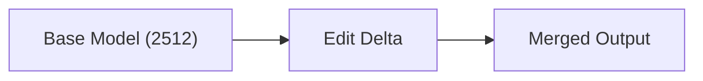
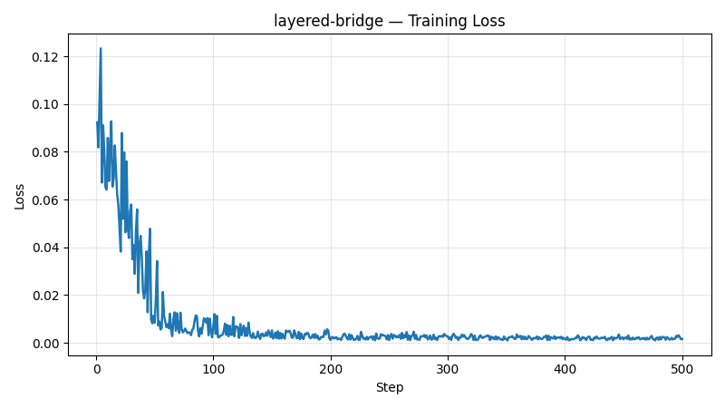
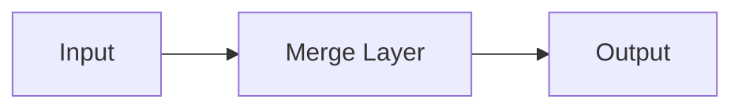

# Stage 2 Real Training Report

## Run Profile

- Run profile: `full`
- Git commit: `n/a`
- Stage: `stage-2`
- Workflows documented: `core-delta`, `layered-bridge`, `experimental`
- Report generated from: `stage-2/run-status.json`, `reports/stage-2/merge-manifest.json`

## Hardware

- Hostname: `nodegpu217`
- Platform: `Linux-4.18.0-553.42.1.el8_10.x86_64-x86_64-with-glibc2.28`
- Python: `3.12.13`
- CPU: `x86_64`
- Logical cores: `128`
- CUDA available: `True`
- GPU count: `2`
- Selected device: `cuda`
- GPU `cuda:0`: `NVIDIA A100-SXM4-80GB` (85.098 GB, SMs=108, cc=8.0)
- GPU `cuda:1`: `NVIDIA A100-SXM4-80GB` (85.098 GB, SMs=108, cc=8.0)

## Aggregate Timing

- Total elapsed across all workflows: `7089.8s (01h 58m 09s)`

## Runtime / Job Summary

| Job | Status | Duration (s) | Exit code | Log |
| --- | --- | --- | --- | --- |
| `consistency_eval` | `succeeded` | `1109.2909` | `0` | `stage-2/logs/consistency-eval.log` |
| `core_delta_sweep` | `succeeded` | `1065.4573` | `0` | `stage-2/logs/core-delta-sweep.log` |
| `core_edit_eval` | `succeeded` | `649.1934` | `0` | `stage-2/logs/core-edit-eval.log` |
| `core_smoke_eval` | `succeeded` | `305.1985` | `0` | `stage-2/logs/core-smoke-eval.log` |
| `experimental_smoke_eval` | `succeeded` | `331.2621` | `0` | `stage-2/logs/experimental-smoke-eval.log` |
| `layered_bridge_train` | `succeeded` | `31.3337` | `0` | `stage-2/logs/layered-bridge-train.log` |
| `teacher_dataset_generation` | `succeeded` | `3598.0664` | `0` | `stage-2/logs/teacher-dataset.log` |

---

## Workflow: core-delta

### Training Method
- Type: `coefficient-sweep`
- Model: `Qwen/Qwen-Image-2512 + Qwen/Qwen-Image-Edit-2511`
- Objective: `edit-delta blend sweep`
- Optimizer: `n/a`
- Notes: Image-level delta sweep over blend weights [0.2, 0.3, 0.35, 0.4]. No gradient-based training.

### Hyperparameters
- Max steps: `n/a`
- Batch size: `n/a`
- Learning rate: `n/a`
- Seed: `n/a`

### Timing
- Start: `2026-03-24T10:40:16.506529+00:00`
- End: `2026-03-24T10:58:01.967804+00:00`
- Elapsed: `1065.5s (00h 17m 45s)`
- Job status: `succeeded`

### Loss
- Final: `n/a`
- Min: `n/a`
- Max: `n/a`

_No loss curve data available._

_Loss curve figure unavailable (matplotlib not installed or `loss_curve` absent in metrics)._

### Structure Visualization

### Visual Outcomes (Before / After Merge)

_Before sample not available at `stage-2/evals/core-delta/samples/`._

_After sample not yet available at `stage-2/evals/core-delta/real-samples/`._

## Workflow: layered-bridge

### Training Method
- Type: `bridge-distillation-smoke-proxy`
- Model: `TinyBridge`
- Objective: `MSE reconstruction on RGB teacher set`
- Optimizer: `Adam`
- Notes: This is a smoke-stage proxy, not the final bridge training recipe.

### Hyperparameters
- Max steps: `500`
- Batch size: `2`
- Learning rate: `0.001`
- Seed: `1234`

### Timing
- Start: `2026-03-24T12:03:14.182373+00:00`
- End: `2026-03-24T12:03:35.948830+00:00`
- Elapsed: `4.8s (00h 00m 04s)`
- Job status: `succeeded`

### Loss
- Final: `0.0016438349848613143`
- Min: `0.000956448377110064`
- Max: `0.12330838292837143`

| Step | Loss |
| ---: | ---: |
| 1 | 0.092334 |
| 2 | 0.081858 |
| 3 | 0.103077 |
| 4 | 0.123308 |
| 5 | 0.067125 |
| … | _(steps 6–495 omitted)_ |
| 496 | 0.002484 |
| 497 | 0.003186 |
| 498 | 0.002342 |
| 499 | 0.001504 |
| 500 | 0.001644 |

### Structure Visualization

### Visual Outcomes (Before / After Merge)

_Before sample not available at `stage-2/evals/layered-bridge/samples/`._

_After sample not yet available at `stage-2/evals/layered-bridge/real-samples/`._

## Workflow: experimental

### Training Method
- Type: `experimental-smoke-eval`
- Model: `stage-2/artifacts/experimental/qwen-image-1.9-layered-bridge-bf16.safetensors`
- Objective: `smoke quality check on layered bridge checkpoint`
- Optimizer: `n/a`
- Notes: Experimental eval: visual pass/fail on the layered bridge checkpoint after MSE distillation training.

### Hyperparameters
- Max steps: `n/a`
- Batch size: `n/a`
- Learning rate: `n/a`
- Seed: `n/a`

### Timing
- Start: `2026-03-24T12:03:36.658120+00:00`
- End: `2026-03-24T12:09:07.929929+00:00`
- Elapsed: `331.3s (00h 05m 31s)`
- Job status: `succeeded`

### Loss
- Final: `n/a`
- Min: `n/a`
- Max: `n/a`

_No loss curve data available._

_Loss curve figure unavailable (matplotlib not installed or `loss_curve` absent in metrics)._

### Structure Visualization

### Visual Outcomes (Before / After Merge)

**Before** (baseline eval sample — `stage-2/evals/experimental/samples/`):

_After sample not yet available at `stage-2/evals/experimental/real-samples/`._

---

## Workflow Coverage

| Workflow | Status | Metrics source | Duration (s) |
| --- | --- | --- | --- |
| `core-delta` | `succeeded` | `stage-2/metrics/core-delta-train.json` | `1065.457` |
| `layered-bridge` | `succeeded` | `stage-2/metrics/layered-bridge-train.json` | `31.3337` |
| `experimental` | `succeeded` | `stage-2/metrics/experimental-train.json` | `331.262` |

## Artifact References

- Merge manifest: `reports/stage-2/merge-manifest.json`
- Dataset manifest: `reports/stage-2/dataset-manifest.json`
- Run status: `stage-2/run-status.json`
- Figures: `reports/stage-2/figures/`
