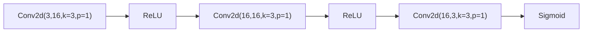

# Stage 2 Real Training Report

## Run Profile

- Run profile: `full`
- Git commit: `n/a`
- Stage: `stage-2`
- Workflows documented: `core-delta`, `layered-bridge`, `experimental`
- Report generated from: `stage-2/run-status.json`, `reports/stage-2-merge-manifest.json`

## Hardware

- Hostname: `nodegpu246`
- Platform: `Linux-4.18.0-553.42.1.el8_10.x86_64-x86_64-with-glibc2.28`
- Python: `3.12.13`
- CPU: `x86_64`
- Logical cores: `128`
- CUDA available: `True`
- GPU count: `2`
- Selected device: `cuda`
- GPU `cuda:0`: `NVIDIA A100-SXM4-80GB` (85.098 GB, SMs=108, cc=8.0)
- GPU `cuda:1`: `NVIDIA A100-SXM4-80GB` (85.098 GB, SMs=108, cc=8.0)

## Aggregate Timing

- Total elapsed across all workflows: `2.6s (00h 00m 02s)`

## Runtime / Job Summary

| Job | Status | Duration (s) | Exit code | Log |
| --- | --- | --- | --- | --- |
| `core_delta_sweep` | `succeeded` | `686.6836` | `0` | `stage-2/logs/core-delta-sweep.log` |
| `core_smoke_eval` | `succeeded` | `264.7904` | `0` | `stage-2/logs/core-smoke-eval.log` |
| `experimental_smoke_eval` | `succeeded` | `265.9189` | `0` | `stage-2/logs/experimental-smoke-eval.log` |
| `layered_bridge_train` | `succeeded` | `22.253` | `0` | `stage-2/logs/layered-bridge-train.log` |
| `teacher_dataset_generation` | `succeeded` | `3414.4815` | `0` | `stage-2/logs/teacher-dataset.log` |

---

## Workflow: core-delta

_Metrics file not found at `stage-2/metrics/core-delta-train.json`. This workflow has not been executed yet._

## Workflow: layered-bridge

### Training Method
- Type: `bridge-distillation-smoke-proxy`
- Model: `TinyBridge`
- Objective: `MSE reconstruction on RGB teacher set`
- Optimizer: `Adam`
- Notes: This is a smoke-stage proxy, not the final bridge training recipe.

### Hyperparameters
- Max steps: `500`
- Batch size: `1`
- Learning rate: `0.001`
- Seed: `1234`

### Timing
- Start: `2026-03-23T21:56:43.957228+00:00`
- End: `2026-03-23T21:57:02.649812+00:00`
- Elapsed: `2.6s (00h 00m 02s)`
- Job status: `succeeded`

### Loss
- Final: `0.00239641685038805`
- Min: `0.0008023153059184551`
- Max: `0.13178911805152893`

| Step | Loss |
| ---: | ---: |
| 1 | 0.112798 |
| 2 | 0.071192 |
| 3 | 0.088174 |
| 4 | 0.071560 |
| 5 | 0.131789 |
| … | _(steps 6–495 omitted)_ |
| 496 | 0.001783 |
| 497 | 0.000922 |
| 498 | 0.003972 |
| 499 | 0.004799 |
| 500 | 0.002396 |

### Structure Visualization

### Visual Outcomes (Before / After Merge)

_Before sample not available at `stage-2/evals/layered-bridge/samples/`._

_After sample not yet available at `stage-2/evals/layered-bridge/real-samples/`._

## Workflow: experimental

_Metrics file not found at `stage-2/metrics/experimental-train.json`. This workflow has not been executed yet._

---

## Workflow Coverage

| Workflow | Status | Metrics source | Duration (s) |
| --- | --- | --- | --- |
| `core-delta` | `not executed` | `stage-2/metrics/core-delta-train.json` | — |
| `layered-bridge` | `succeeded` | `stage-2/metrics/layered-bridge-train.json` | `22.253` |
| `experimental` | `not executed` | `stage-2/metrics/experimental-train.json` | — |

## Artifact References

- Merge manifest: `reports/stage-2-merge-manifest.json`
- Dataset manifest: `reports/stage-2/dataset-manifest.json`
- Run status: `stage-2/run-status.json`
- Figures: `reports/stage-2/figures/`
