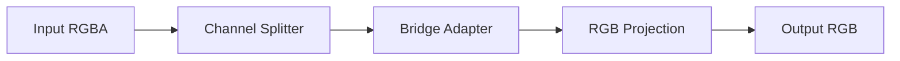

# Stage 2 Real Training Report

## Run Profile

- Run profile: `smoke`
- Git commit: `n/a`
- Stage: `stage-2`
- Workflows documented: `core-delta`, `layered-bridge`, `experimental`
- Report generated from: `stage-2/run-status.json`, `reports/stage-2-merge-manifest.json`

## Hardware

_Hardware metadata not present in any workflow metrics file._

## Aggregate Timing

- Total elapsed across all workflows: `1.0s (00h 00m 00s)`

## Runtime / Job Summary

| Job | Status | Duration (s) | Exit code | Log |
| --- | --- | --- | --- | --- |
| `core_delta_sweep` | `succeeded` | `105.3263` | `0` | `stage-2/logs/core-delta-sweep.log` |
| `core_smoke_eval` | `succeeded` | `55.0693` | `0` | `stage-2/logs/core-smoke-eval.log` |
| `experimental_smoke_eval` | `failed` | `44.608` | `1` | `stage-2/logs/experimental-smoke-eval.log` |
| `layered_bridge_train` | `succeeded` | `7.3191` | `0` | `stage-2/logs/layered-bridge-train.log` |
| `teacher_dataset_generation` | `succeeded` | `224.851` | `0` | `stage-2/logs/teacher-dataset.log` |

---

## Workflow: core-delta

_Metrics file not found at `stage-2/metrics/core-delta-train.json`. This workflow has not been executed yet._

## Workflow: layered-bridge

### Training Method
- Type: `unknown`
- Model: `unknown`
- Objective: `unknown`
- Optimizer: `unknown`
- Notes: n/a

### Hyperparameters
- Max steps: `64`
- Batch size: `1`
- Learning rate: `n/a`
- Seed: `n/a`

### Timing
- Start: `n/a`
- End: `n/a`
- Elapsed: `1.0s (00h 00m 00s)`
- Job status: `succeeded`

### Loss
- Final: `0.05175413936376572`
- Min: `n/a`
- Max: `n/a`

| Step | Loss |
| ---: | ---: |
| 1 | 0.126804 |
| 2 | 0.078841 |
| 3 | 0.140734 |
| 4 | 0.076093 |
| 5 | 0.131384 |
| … | _(steps 6–59 omitted)_ |
| 60 | 0.037081 |
| 61 | 0.020786 |
| 62 | 0.054110 |
| 63 | 0.037735 |
| 64 | 0.051754 |

_Loss curve figure unavailable (matplotlib not installed or `loss_curve` absent in metrics)._

### Structure Visualization

### Visual Outcomes (Before / After Merge)

_Before sample not available at `stage-2/evals/layered-bridge/samples/`._

_After sample not yet available at `stage-2/evals/layered-bridge/real-samples/`._

## Workflow: experimental

_Metrics file not found at `stage-2/metrics/experimental-train.json`. This workflow has not been executed yet._

---

## Workflow Coverage

| Workflow | Status | Metrics source | Duration (s) |
| --- | --- | --- | --- |
| `core-delta` | `not executed` | `stage-2/metrics/core-delta-train.json` | — |
| `layered-bridge` | `succeeded` | `stage-2/metrics/layered-bridge-train.json` | `7.3191` |
| `experimental` | `not executed` | `stage-2/metrics/experimental-train.json` | — |

## Artifact References

- Merge manifest: `reports/stage-2-merge-manifest.json`
- Dataset manifest: `reports/stage-2/dataset-manifest.json`
- Run status: `stage-2/run-status.json`
- Figures: `reports/stage-2/figures/`
