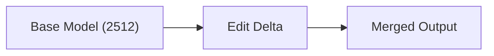
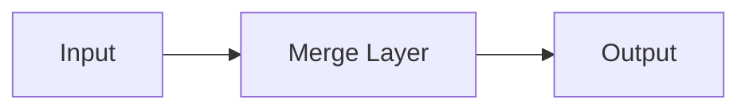

# Stage 2 Real Training Report

## Run Profile

- Run profile: `full`
- Git commit: `n/a`
- Stage: `stage-2`
- Workflows documented: `core-delta`, `layered-bridge`, `experimental`
- Report generated from: `reports/stage-2/run-status.json`, `reports/stage-2/merge-manifest.json`

## Hardware

- Hostname: `nodegpu217`
- Platform: `Linux-4.18.0-553.42.1.el8_10.x86_64-x86_64-with-glibc2.28`
- Python: `3.12.13`
- CPU: `x86_64`
- Logical cores: `128`
- CUDA available: `True`
- GPU count: `2`
- Selected device: `cuda`
- GPU `cuda:0`: `NVIDIA A100-SXM4-80GB` (85.098 GB, SMs=108, cc=8.0)
- GPU `cuda:1`: `NVIDIA A100-SXM4-80GB` (85.098 GB, SMs=108, cc=8.0)

## Aggregate Timing

- Total elapsed across all workflows: `6146.6s (01h 42m 26s)`

## Runtime / Job Summary

| Job | Status | Duration (s) | Exit code | Log |
| --- | --- | --- | --- | --- |
| `consistency_eval` | `succeeded` | `1033.6228` | `0` | `reports/stage-2/logs/consistency-eval.log` |
| `core_delta_sweep` | `succeeded` | `1184.1361` | `0` | `reports/stage-2/logs/core-delta-sweep.log` |
| `core_edit_eval` | `succeeded` | `617.5378` | `0` | `reports/stage-2/logs/core-edit-eval.log` |
| `core_smoke_eval` | `succeeded` | `338.6642` | `0` | `reports/stage-2/logs/core-smoke-eval.log` |
| `experimental_smoke_eval` | `succeeded` | `334.4732` | `0` | `reports/stage-2/logs/experimental-smoke-eval.log` |
| `layered_bridge_train` | `succeeded` | `25.1272` | `0` | `reports/stage-2/logs/layered-bridge-train.log` |
| `teacher_dataset_generation` | `succeeded` | `2613.0654` | `0` | `reports/stage-2/logs/teacher-dataset.log` |

---

## Workflow: core-delta

### Training Method
- Type: `coefficient-sweep`
- Model: `Qwen/Qwen-Image-2512 + Qwen/Qwen-Image-Edit-2511`
- Objective: `edit-delta blend sweep`
- Optimizer: `n/a`
- Notes: Image-level delta sweep over blend weights [0.2, 0.3, 0.35, 0.4]. No gradient-based training.

### Hyperparameters
- Max steps: `n/a`
- Batch size: `n/a`
- Learning rate: `n/a`
- Seed: `n/a`

### Timing
- Start: `2026-03-24T22:56:57.540964+00:00`
- End: `2026-03-24T23:16:41.683419+00:00`
- Elapsed: `1184.1s (00h 19m 44s)`
- Job status: `succeeded`

### Loss
- Final: `n/a`
- Min: `n/a`
- Max: `n/a`

_No loss curve data available._

_Loss curve figure unavailable (matplotlib not installed or `loss_curve` absent in metrics)._

### Structure Visualization

### Visual Outcomes (Before / After Merge)

_Before sample not available at `reports/stage-2/evals/core-delta/samples/`._

_After sample not yet available at `reports/stage-2/evals/core-delta/real-samples/`._

## Workflow: layered-bridge

### Training Method
- Type: `bridge-distillation-smoke-proxy`
- Model: `TinyBridge`
- Objective: `MSE reconstruction on RGB teacher set`
- Optimizer: `Adam`
- Notes: This is a smoke-stage proxy, not the final bridge training recipe.

### Hyperparameters
- Max steps: `1000`
- Batch size: `2`
- Learning rate: `0.001`
- Seed: `1234`

### Timing
- Start: `2026-03-25T00:06:02.705275+00:00`
- End: `2026-03-25T00:06:17.943173+00:00`
- Elapsed: `3.3s (00h 00m 03s)`
- Job status: `succeeded`

### Loss
- Final: `0.0014378068735823035`
- Min: `0.0007670784252695739`
- Max: `0.1135181412100792`

| Step | Loss |
| ---: | ---: |
| 1 | 0.090859 |
| 2 | 0.091829 |
| 3 | 0.097404 |
| 4 | 0.110781 |
| 5 | 0.066881 |
| … | _(steps 6–995 omitted)_ |
| 996 | 0.001383 |
| 997 | 0.001953 |
| 998 | 0.001322 |
| 999 | 0.001256 |
| 1000 | 0.001438 |

### Structure Visualization

### Visual Outcomes (Before / After Merge)

_Before sample not available at `reports/stage-2/evals/layered-bridge/samples/`._

_After sample not yet available at `reports/stage-2/evals/layered-bridge/real-samples/`._

## Workflow: experimental

### Training Method
- Type: `experimental-smoke-eval`
- Model: `reports/stage-2/artifacts/experimental/qwen-image-1.9-layered-bridge-bf16.safetensors`
- Objective: `smoke quality check on layered bridge checkpoint`
- Optimizer: `n/a`
- Notes: Experimental eval: visual pass/fail on the layered bridge checkpoint after MSE distillation training.

### Hyperparameters
- Max steps: `n/a`
- Batch size: `n/a`
- Learning rate: `n/a`
- Seed: `n/a`

### Timing
- Start: `2026-03-25T00:06:18.600890+00:00`
- End: `2026-03-25T00:11:53.077110+00:00`
- Elapsed: `334.5s (00h 05m 34s)`
- Job status: `succeeded`

### Loss
- Final: `n/a`
- Min: `n/a`
- Max: `n/a`

_No loss curve data available._

_Loss curve figure unavailable (matplotlib not installed or `loss_curve` absent in metrics)._

### Structure Visualization

### Visual Outcomes (Before / After Merge)

**Before** (baseline eval sample — `reports/stage-2/evals/experimental/samples/`):

_After sample not yet available at `reports/stage-2/evals/experimental/real-samples/`._

---

## Workflow Coverage

| Workflow | Status | Metrics source | Duration (s) |
| --- | --- | --- | --- |
| `core-delta` | `succeeded` | `reports/stage-2/metrics/core-delta-train.json` | `1184.136` |
| `layered-bridge` | `succeeded` | `reports/stage-2/metrics/layered-bridge-train.json` | `25.1272` |
| `experimental` | `succeeded` | `reports/stage-2/metrics/experimental-train.json` | `334.473` |

## Artifact References

- Merge manifest: `reports/stage-2/merge-manifest.json`
- Dataset manifest: `reports/stage-2/dataset-manifest.json`
- Run status: `reports/stage-2/run-status.json`
- Figures: `reports/stage-2/figures/`
